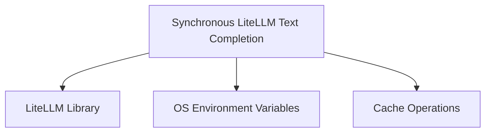

# sync_text_completion

The `sync_text_completion` module provides synchronous text completion capabilities within the DSPy framework, primarily leveraging the LiteLLM library. It offers a streamlined interface for interacting with various language models for text generation tasks, handling details such as API key management, prompt formatting, and retry mechanisms.

## Purpose and Core Functionality

The primary component of this module is `dspy.clients.lm.litellm_text_completion`. This function is designed to facilitate synchronous calls to language models for text completion.

### `litellm_text_completion`

```python
def litellm_text_completion(request: dict[str, Any], num_retries: int, cache: dict[str, Any] | None = None):
    # ... (simplified for documentation)
    # Extracts provider and model from request
    # Retrieves API key and base from request or environment variables
    # Builds prompt from messages in the request
    return litellm.text_completion(
        cache=cache,
        model=f"text-completion-openai/{model}",
        api_key=api_key,
        api_base=api_base,
        prompt=prompt,
        num_retries=num_retries,
        retry_strategy="exponential_backoff_retry",
        headers=_add_dspy_identifier_to_headers(headers),
        **request,
    )
```

**Key Features:**

*   **Synchronous Execution:** Executes text completion requests in a blocking manner, suitable for contexts where immediate results are needed without asynchronous programming overhead.
*   **LiteLLM Integration:** Acts as a wrapper around `litellm.text_completion`, abstracting away the direct LiteLLM API calls and integrating them seamlessly into the DSPy ecosystem.
*   **Flexible Configuration:** Allows specifying the language model, API key, and base URL either directly in the request or via environment variables, offering adaptability across different deployment environments and LLM providers.
*   **Prompt Construction:** Automatically constructs the final prompt string from a list of messages provided in the request, adhering to a "BEGIN RESPONSE:" convention.
*   **Retry Mechanism:** Incorporates a robust exponential backoff retry strategy to handle transient network issues or API rate limits, improving the reliability of LLM interactions.
*   **Caching Support:** Supports caching of responses via the `cache` parameter, which can significantly reduce latency and cost for repeated requests.
*   **DSPy Identifier:** Adds a DSPy-specific identifier to request headers, useful for tracking and analytics.

## Architecture and Component Relationships

The `sync_text_completion` module, containing the `litellm_text_completion` function, is a leaf module responsible for a specific, synchronous interaction pattern with LLMs. It relies on external libraries and DSPy's internal utilities for its operations.

<!-- DIAGRAM_JSON
{
    "direction": "TD",
    "nodes": [
        {"id": "litellm_text_completion", "label": "Synchronous LiteLLM Text Completion", "type": "component", "link": null},
        {"id": "litellm_lib", "label": "LiteLLM Library", "type": "external", "link": null},
        {"id": "os_env", "label": "OS Environment Variables", "type": "external", "link": null},
        {"id": "cache_operations", "label": "Cache Operations", "type": "external", "link": "cache_operations.md"}
    ],
    "edges": [
        {"source": "litellm_text_completion", "target": "litellm_lib"},
        {"source": "litellm_text_completion", "target": "os_env"},
        {"source": "litellm_text_completion", "target": "cache_operations"}
    ],
    "groups": []
}
-->


**Relationships:**

*   **`litellm_text_completion`** is the core functional unit within this module.
*   It **depends on the `LiteLLM Library`** to perform the actual text completion calls to various LLM providers. LiteLLM serves as the universal API for interacting with different models.
*   It **interacts with `OS Environment Variables`** to dynamically retrieve API keys and base URLs, promoting secure and flexible configuration without hardcoding sensitive information.
*   It **utilizes `Cache Operations`** (as defined in [cache_operations.md](cache_operations.md)) by accepting a `cache` parameter, enabling it to integrate with DSPy's caching mechanisms for improved performance and cost efficiency.

## Integration with the Overall System

The `sync_text_completion` module plays a crucial role in the `dspy.clients` ecosystem, particularly within the [litellm_api_clients](litellm_api_clients.md) and [text_completion_handlers](text_completion_handlers.md) modules.

*   **Part of `text_completion_handlers`**: It is a concrete implementation of a text completion handler, specifically for synchronous operations. This makes it a foundational block for any DSPy module that needs to perform text generation in a blocking fashion.
*   **Foundation for DSPy Programs**: DSPy programs and modules that require direct text generation from language models will often implicitly or explicitly use this function to interact with the underlying LLMs.
*   **Consistency and Abstraction**: By centralizing synchronous text completion logic, it ensures consistent behavior across different parts of the DSPy framework, abstracting away the complexities of direct LiteLLM calls and API management. This promotes cleaner, more maintainable code within DSPy programs.