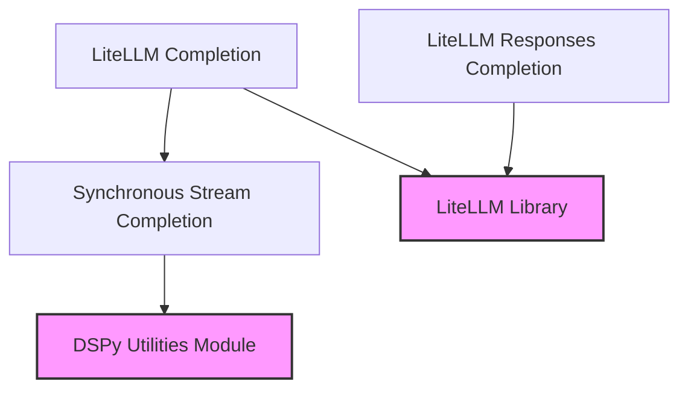

# synchronous_handlers Module

The `synchronous_handlers` module is a vital part of the `dspy.clients.lm.chat_completion_handlers` package, specifically designed to manage synchronous interactions with the LiteLLM library for chat completions. It provides functionalities for handling standard chat completion requests, fetching structured responses, and managing synchronous streaming of completion results.

## Architecture and Component Relationships

This module orchestrates synchronous calls to the LiteLLM library, ensuring that all interactions, from simple completions to streaming responses, are handled in a blocking manner. It integrates with utility functions for request preparation and stream processing, maintaining a clear separation of concerns.

<!-- DIAGRAM_JSON
{
    "direction": "TD",
    "nodes": [
        {"id": "litellm_completion", "label": "LiteLLM Completion", "type": "component", "link": null},
        {"id": "litellm_responses_completion", "label": "LiteLLM Responses Completion", "type": "component", "link": null},
        {"id": "sync_stream_completion", "label": "Synchronous Stream Completion", "type": "component", "link": null},
        {"id": "litellm_library", "label": "LiteLLM Library", "type": "external", "link": null},
        {"id": "dspy_utilities", "label": "DSPy Utilities Module", "type": "external", "link": "dspy_utilities.md"}
    ],
    "edges": [
        {"source": "litellm_completion", "target": "litellm_library"},
        {"source": "litellm_completion", "target": "sync_stream_completion"},
        {"source": "litellm_responses_completion", "target": "litellm_library"},
        {"source": "sync_stream_completion", "target": "dspy_utilities"}
    ],
    "groups": []
}
-->



## Core Functionality

### `litellm_completion`

```python
def litellm_completion(request: dict[str, Any], num_retries: int, cache: dict[str, Any] | None = None):
    cache = cache or {"no-cache": True, "no-store": True}
    request = dict(request)
    request.pop("rollout_id", None)
    headers = _add_dspy_identifier_to_headers(request.pop("headers", None))
    stream_completion = _get_stream_completion_fn(request, cache, sync=True, headers=headers)
    if stream_completion is None:
        return litellm.completion(
            cache=cache,
            num_retries=num_retries,
            retry_strategy="exponential_backoff_retry",
            headers=headers,
            **request,
        )

    return stream_completion()
```

This function handles synchronous chat completion requests using the LiteLLM library. It prepares the request by adding DSPy-specific headers and managing caching. If a streaming completion function is available, it utilizes it; otherwise, it makes a direct non-streaming LiteLLM completion call. It supports retry mechanisms with exponential backoff.

### `litellm_responses_completion`

```python
def litellm_responses_completion(request: dict[str, Any], num_retries: int, cache: dict[str, Any] | None = None):
    cache = cache or {"no-cache": True, "no-store": True}
    request = dict(request)
    request.pop("rollout_id", None)
    headers = request.pop("headers", None)
    request = _convert_chat_request_to_responses_request(request)

    return litellm.responses(
        cache=cache,
        num_retries=num_retries,
        retry_strategy="exponential_backoff_retry",
        headers=_add_dspy_identifier_to_headers(headers),
        **request,
    )
```

This function is responsible for processing synchronous chat completion requests and obtaining structured responses from the LiteLLM library. It transforms the incoming chat request into a format suitable for LiteLLM's `responses` API and applies caching and retry logic. DSPy-specific identifiers are also added to the request headers.

### `sync_stream_completion`

```python
    def sync_stream_completion():
        syncified_stream_completion = syncify(stream_completion)
        return syncified_stream_completion(request, cache_kwargs)
```

This internal helper function wraps an asynchronous stream completion function to make it callable synchronously. It uses the `syncify` utility from the [dspy_utilities](dspy_utilities.md) module to convert an async stream into a blocking one, allowing synchronous processing of streamed chat completion results. This ensures that streaming can be handled within a synchronous execution flow when required.
