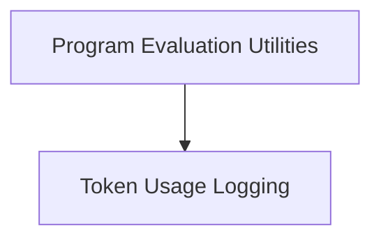

# Teleprompt Utilities Module

## Introduction
The `teleprompt_utils` module provides a collection of utility functions designed to support various teleprompting strategies within the DSPy framework. These utilities assist in evaluating program quality, logging critical metrics like token usage, and analyzing the execution history of candidate programs. It plays a crucial role in the development and optimization of robust language model pipelines.

## Architecture
The `teleprompt_utils` module is composed of several functional sub-modules, each handling a specific aspect of teleprompting support. The primary sub-modules include tools for program evaluation and token usage logging.

<!-- DIAGRAM_JSON
{
    "direction": "TD",
    "nodes": [
        {"id": "program_evaluation", "label": "Program Evaluation Utilities", "type": "module", "link": "program_evaluation.md"},
        {"id": "token_logging", "label": "Token Usage Logging", "type": "module", "link": "token_logging.md"}
    ],
    "edges": [
        {"source": "program_evaluation", "target": "token_logging"}
    ],
    "groups": []
}
-->

## Sub-modules
This module contains the following key sub-modules:

*   **[Program Evaluation Utilities](program_evaluation.md)**: This sub-module focuses on functions for assessing the performance and execution traces of programs, including retrieving model history and calculating proposed program quality.
*   **[Token Usage Logging](token_logging.md)**: This sub-module provides functionality for extracting and logging token usage information from language models during teleprompting trials.
