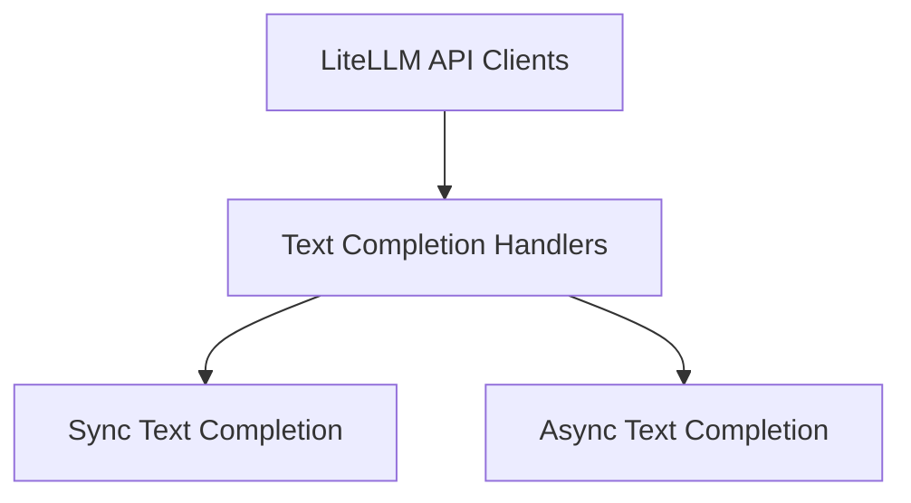

# Text Completion Handlers Module

The `text_completion_handlers` module is a crucial component within the LiteLLM API clients, specifically designed to manage and process text completion requests. It provides both synchronous and asynchronous interfaces to interact with various language models via the LiteLLM library, handling request preparation, API key management, and retry mechanisms.

## Architecture Overview

This module integrates with the broader LiteLLM API client ecosystem, facilitating seamless communication with text completion models. It abstracts away the complexities of API interactions, offering a streamlined interface for developers.

<!-- DIAGRAM_JSON
{
    "direction": "TD",
    "nodes": [
        {"id": "litellm_api_clients", "label": "LiteLLM API Clients", "type": "module", "link": "litellm_api_clients.md"},
        {"id": "text_completion_handlers", "label": "Text Completion Handlers", "type": "module"},
        {"id": "sync_text_completion", "label": "Sync Text Completion", "type": "module", "link": "sync_text_completion.md"},
        {"id": "async_text_completion", "label": "Async Text Completion", "type": "module", "link": "async_text_completion.md"}
    ],
    "edges": [
        {"source": "litellm_api_clients", "target": "text_completion_handlers"},
        {"source": "text_completion_handlers", "target": "sync_text_completion"},
        {"source": "text_completion_handlers", "target": "async_text_completion"}
    ],
    "groups": []
}
-->

## Sub-modules

### [Synchronous Text Completion](sync_text_completion.md)

This sub-module (`sync_text_completion`) is responsible for handling synchronous text completion requests. It prepares the request payload, manages API keys and bases, constructs the prompt from messages, and interacts with the LiteLLM `text_completion` function to get a response. It also incorporates retry strategies for robust API calls.

### [Asynchronous Text Completion](async_text_completion.md)

The `async_text_completion` sub-module provides an asynchronous interface for text completion. Similar to its synchronous counterpart, it manages request parameters, API keys, and prompt construction. It leverages LiteLLM's `atext_completion` function, enabling non-blocking API calls for improved performance in asynchronous applications.