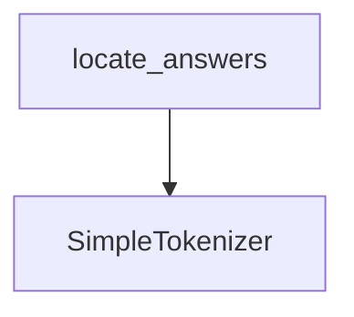

# `text_processing` Module Documentation

## Introduction

The `text_processing` module, part of the `dspy.dsp.utils.dpr` package, provides core utilities for text tokenization and precise answer localization within text documents. It is specifically designed to support Dense Passage Retrieval (DPR) related tasks by offering fundamental text manipulation capabilities.

## Architecture and Component Relationships

This module contains two primary components: `SimpleTokenizer` for breaking down text into tokens, and `locate_answers` for finding the exact character-based positions of answers within a tokenized text. The `locate_answers` function relies on tokenization, which is conceptually provided by components like `SimpleTokenizer` within this module's scope.

<!-- DIAGRAM_JSON
{
    "direction": "TD",
    "nodes": [
        {"id": "simple_tokenizer", "label": "SimpleTokenizer", "type": "component", "link": null},
        {"id": "locate_answers_func", "label": "locate_answers", "type": "component", "link": null}
    ],
    "edges": [
        {"source": "locate_answers_func", "target": "simple_tokenizer"}
    ],
    "groups": []
}
-->

## Core Functionality

### `SimpleTokenizer`

`SimpleTokenizer` is a basic tokenizer class designed to segment text into individual tokens based on alphanumeric characters and non-whitespace patterns. It uses regular expressions for efficient parsing.

*   **Purpose**: To convert raw text into a stream of tokens, a foundational step for many natural language processing tasks.
*   **Key Features**:
    *   Utilizes Unicode-aware regular expressions (`regex` library) to handle a wide range of characters.
    *   Identifies alphanumeric sequences and individual non-whitespace characters as tokens.
    *   The `tokenize` method returns a `Tokens` object (presumably an internal DSPy data structure) containing the token, the associated whitespace, and its span in the original text.

### `locate_answers`

The `locate_answers` function is responsible for finding all occurrences of a set of tokenized answers within a given text, returning their start and end character positions.

*   **Purpose**: To precisely identify the boundaries of known answers within a larger document, crucial for tasks like question answering or fact extraction.
*   **Key Features**:
    *   Takes tokenized answers and the raw text as input.
    *   Internally tokenizes the input text (via `DPR_tokenize`, which is typically a specific tokenizer used for Dense Passage Retrieval, potentially leveraging functionality similar to `SimpleTokenizer`).
    *   Performs a sequence matching operation, comparing the tokenized answer phrases against the tokenized text (case-insensitively).
    *   Returns a list of `(offset, endpos)` tuples, representing the character start and end positions for each found occurrence of an answer.

## How it Fits into the Overall System

As a sub-module of `dpr_utilities` within `dspy_dsp_utilities`, `text_processing` plays a critical role in the broader DSPy framework by providing essential text manipulation capabilities for tasks involving Dense Passage Retrieval (DPR). Its components enable the initial processing of text into a manageable format and the precise identification of answer spans, which are foundational for many information retrieval and question-answering pipelines in DSPy. This module underpins the ability of other DSPy components to understand and interact with textual data effectively. You can find more information about its parent module in the [dpr_utilities.md](dpr_utilities.md) documentation.