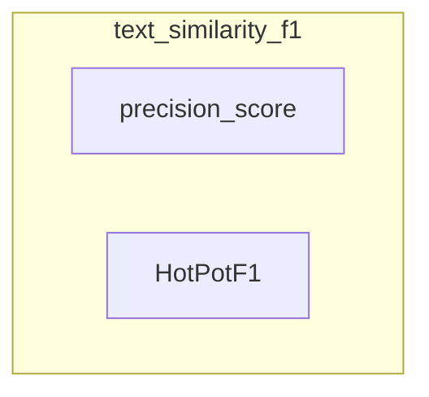

# text_similarity_f1
This module offers text similarity evaluation metrics. It provides `precision_score` for token-level precision and `HotPotF1` for calculating HotPotQA-style F1 scores against multiple reference answers.

<!-- DIAGRAM_JSON
{
    "nodes": [
        {
            "id": "text_similarity_f1",
            "label": "text_similarity_f1",
            "type": "module"
        },
        {
            "id": "precision_score",
            "label": "precision_score",
            "type": "component"
        },
        {
            "id": "HotPotF1",
            "label": "HotPotF1",
            "type": "component"
        }
    ],
    "edges": [],
    "groups": [
        {
            "id": "text_similarity_f1_group",
            "label": "text_similarity_f1",
            "nodes": [
                "precision_score",
                "HotPotF1"
            ]
        }
    ]
}
-->
