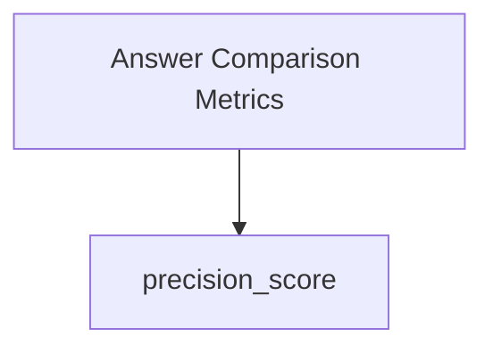

# Token Precision Metric

The `token_precision_metric` module provides a utility function for calculating token-level precision between a predicted answer and a ground truth reference. This metric is crucial for evaluating the accuracy of text generation models, particularly in tasks where the exactness of token overlap is important.

<!-- DIAGRAM_JSON
{
    "direction": "TD",
    "nodes": [
        {"id": "precision_score_func", "label": "precision_score", "type": "component", "link": null},
        {"id": "answer_comparison_metrics", "label": "Answer Comparison Metrics", "type": "external", "link": "answer_comparison_metrics.md"}
    ],
    "edges": [
        {"source": "answer_comparison_metrics", "target": "precision_score_func"}
    ],
    "groups": []
}
-->



### Module Purpose and Core Functionality

The primary purpose of this module is to offer a straightforward and effective way to compute the token-level precision of a generated text against a reference text. The core functionality is encapsulated in the `precision_score` function, which normalizes both the prediction and the ground truth before comparing their token sets.

### Architecture and Component Relationships

The `token_precision_metric` module is a focused unit containing a single core component:

*   **`precision_score`**: This function is the heart of the module. It takes a predicted string and a ground truth string, normalizes them, and then calculates the precision based on overlapping tokens. It relies on internal utility functions like `normalize_text` (for text preprocessing) and `collections.Counter` (for efficient token counting), which are part of the broader `dspy` ecosystem or standard Python libraries.

The module is a leaf in the `dspy.evaluate.metrics.answer_comparison_metrics` hierarchy, providing a specific metric that the higher-level `answer_comparison_metrics` module can leverage for comprehensive answer evaluation.

### How the Module Fits into the Overall System

The `token_precision_metric` module plays a vital role within the [dspy_evaluation](dspy_evaluation.md) framework, specifically as a sub-component of [answer_comparison_metrics](answer_comparison_metrics.md). It contributes to the overall goal of quantitatively assessing the quality of language model outputs. By providing a reliable token-level precision score, it enables developers and researchers to fine-tune models and compare different generation strategies based on how accurately they match reference answers at a granular token level. This module is often used in conjunction with other metrics to provide a holistic view of model performance.

### `dspy.evaluate.metrics.precision_score`

```python
def precision_score(prediction, ground_truth):
    """Compute token-level precision of prediction against reference (after normalization).

    Precision is (# overlapping tokens) / (# tokens in prediction). If there is no
    token overlap, returns 0. If both sides are empty, a diagnostic message is printed;
    precision remains 0.

    Args:
        prediction (str): Predicted answer.
        ground_truth (str): Reference answer.

    Returns:
        float: Precision in [0.0, 1.0].

    Examples:
        ```python
        precision_score("eiffel tower in paris", "eiffel tower")  # 0.67
        ```
    """
    prediction_tokens = normalize_text(prediction).split()
    ground_truth_tokens = normalize_text(ground_truth).split()

    common = Counter(prediction_tokens) & Counter(ground_truth_tokens)
    num_same = sum(common.values())

    if len(prediction_tokens) == len(ground_truth_tokens) == 0:
        # Unlike most tasks, QReCC and SQuAD-2.0 assign 1.0 in this edge case. We don't for uniformity.
        print_message(
            "
#> Precision Metric: Rare edge case of len(prediction_tokens) == len(ground_truth_tokens) == 0.
"
        )

    if num_same == 0:
        return 0

    precision = 1.0 * num_same / len(prediction_tokens)
    return precision
```
