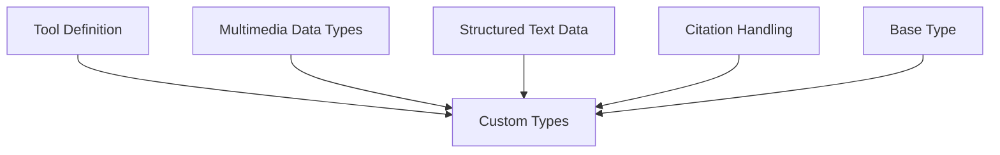

# Tool Definition Module

## Introduction and Purpose

The `tool_definition` module within `dspy.adapters.types` is responsible for defining and managing tools that can be utilized by Language Model Models (LLMs) for function calling. It provides a structured way to wrap Python functions, automatically inferring their metadata (name, description, arguments, and types), and offers robust validation for tool inputs. This module is crucial for enabling LLMs to interact with external functionalities in a consistent and reliable manner.

## Architecture Overview

The `tool_definition` module is a sub-module of [custom_types](custom_types.md), which in turn is part of the larger [dspy_adapters](dspy_adapters.md) module. It provides the core `Tool` class and associated utility functions for defining and validating callable tools.

<!-- DIAGRAM_JSON
{
    "direction": "TD",
    "nodes": [
        {"id": "tool_definition", "label": "Tool Definition", "type": "module", "link": "tool_definition.md"},
        {"id": "custom_types", "label": "Custom Types", "type": "module", "link": "custom_types.md"},
        {"id": "multimedia_data_types", "label": "Multimedia Data Types", "type": "module", "link": "multimedia_data_types.md"},
        {"id": "structured_text_data", "label": "Structured Text Data", "type": "module", "link": "structured_text_data.md"},
        {"id": "citation_handling", "label": "Citation Handling", "type": "module", "link": "citation_handling.md"},
        {"id": "base_type", "label": "Base Type", "type": "module", "link": "base_type.md"}
    ],
    "edges": [
        {"source": "tool_definition", "target": "custom_types"},
        {"source": "multimedia_data_types", "target": "custom_types"},
        {"source": "structured_text_data", "target": "custom_types"},
        {"source": "citation_handling", "target": "custom_types"},
        {"source": "base_type", "target": "custom_types"}
    ],
    "groups": []
}
-->

## High-Level Functionality

### `dspy.adapters.types.tool.Tool`

This is the primary class for defining a tool. It allows developers to encapsulate a Python callable (function) into a structured tool object that LLMs can understand and invoke. Key functionalities include:
- **Automatic Inference**: Automatically extracts the tool's name, description (from docstrings), and argument schema (from type hints) if not explicitly provided.
- **Argument Validation**: Validates input arguments against the inferred or specified JSON schema, ensuring type correctness and adherence to defaults.
- **Asynchronous Support**: Handles both synchronous and asynchronous wrapped functions, with an option to convert async calls to sync for convenience.
- **Integration**: Provides methods to format the tool for LiteLLM function calling and to convert tools from other frameworks like MCP and LangChain.

### `dspy.adapters.types.tool.validate_input`

This utility function is responsible for robustly validating and parsing various input formats that represent tool calls. It provides flexibility in how tool call data can be provided, ensuring that it is correctly transformed into an internal `dspy.ToolCalls` structure for further processing. It supports:
- Direct `Tool` instances.
- Lists of dictionaries, where each dictionary represents a tool call with `name` and `args`.
- Dictionaries containing a `tool_calls` key, which holds a list of tool call dictionaries.
- Single dictionaries with `name` and `args` for a single tool call.
