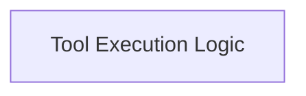

# Tool Execution Bridge Module

## Introduction

The `tool_execution_bridge` module is a critical component within the `dspy.primitives.runner` ecosystem, responsible for facilitating the seamless execution of JavaScript-defined tools within a Python environment. It establishes a communication bridge, allowing Python code to invoke tools and receive their results.

## Architecture Overview

This module operates by creating Python callable wrappers for JavaScript tools and managing the asynchronous communication for tool execution. The `tool_execution_logic` sub-module encapsulates the core functionality for both wrapper generation and the actual call bridging.

<!-- DIAGRAM_JSON
{
    "direction": "TD",
    "nodes": [
        {"id": "tool_execution_logic", "label": "Tool Execution Logic", "type": "module", "link": "tool_execution_logic.md"}
    ],
    "edges": [],
    "groups": []
}
-->

## Sub-modules

### [Tool Execution Logic](tool_execution_logic.md)
This sub-module handles the dynamic creation of Python function wrappers for JavaScript tools and manages the asynchronous communication required to execute these tools and relay their results back to the Python caller.
