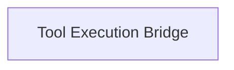

# Tool Runner Module

The `tool_runner` module within `dspy.primitives` is responsible for enabling robust and flexible tool execution, particularly for bridging execution environments (e.g., JavaScript and Python). It provides the necessary mechanisms to wrap external tools and manage their invocation and response handling.

## Architecture

The `tool_runner` module is structured around a core sub-module that handles the generation of tool wrappers and the communication bridge for executing these tools.

<!-- DIAGRAM_JSON
{
    "direction": "TD",
    "nodes": [
        {"id": "tool_execution_bridge", "label": "Tool Execution Bridge", "type": "module", "link": "tool_execution_bridge.md"}
    ],
    "edges": [],
    "groups": []
}
-->

## Sub-modules

### [Tool Execution Bridge](tool_execution_bridge.md)
This sub-module contains the core logic for generating Python wrappers for JavaScript-defined tools and facilitating the inter-process communication required for their execution. It handles parameter serialization, error management, and result deserialization, ensuring a smooth interface between DSPy programs and external tool functionalities.
