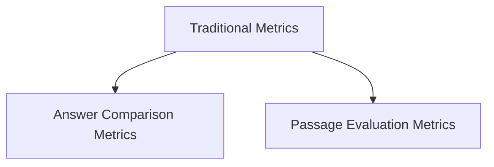

# `traditional_metrics` Module Documentation

The `traditional_metrics` module, part of the `dspy.evaluate` package, provides a collection of established metrics for evaluating the performance of language model predictions. These metrics focus on comparing generated answers against ground truth and assessing the relevance of information within retrieved passages.

## Architecture Overview

The `traditional_metrics` module is structured into two main sub-modules: `answer_comparison_metrics` and `passage_based_metrics`. These sub-modules encapsulate different types of evaluation logic, ensuring a clear separation of concerns.

<!-- DIAGRAM_JSON
{
    "direction": "TD",
    "nodes": [
        {"id": "traditional_metrics", "label": "Traditional Metrics", "type": "module"},
        {"id": "answer_comparison_metrics", "label": "Answer Comparison Metrics", "type": "module", "link": "answer_comparison_metrics.md"},
        {"id": "passage_based_metrics", "label": "Passage Evaluation Metrics", "type": "module", "link": "passage_based_metrics.md"}
    ],
    "edges": [
        {"source": "traditional_metrics", "target": "answer_comparison_metrics"},
        {"source": "traditional_metrics", "target": "passage_based_metrics"}
    ],
    "groups": []
}
-->

## Sub-modules

*   **[Answer Comparison Metrics](answer_comparison_metrics.md)**: This sub-module contains functions for directly comparing predicted answers with reference answers. It includes metrics like exact match, F1 score (HotPotQA-style), and token-level precision.
*   **[Passage Evaluation Metrics](passage_based_metrics.md)**: This sub-module offers metrics for evaluating whether relevant answers are present within the context passages provided by the language model.

## Integration with Overall System

The `traditional_metrics` module is a core component of the `dspy_evaluation` system, providing fundamental tools for assessing the quality and correctness of DSPy programs. It is utilized by higher-level evaluation strategies and helps in developing robust and performant language model pipelines. For more details on the overall evaluation framework, refer to the [dspy_evaluation module documentation](dspy_evaluation.md).
