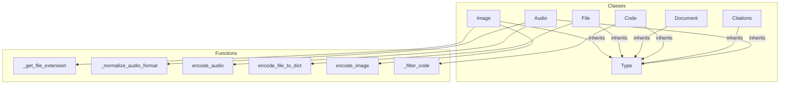

# type_system
The `type_system` module provides a collection of custom data types for DSPy signatures, facilitating structured handling of diverse modalities like audio, images, code, documents, and citations.

<!-- DIAGRAM_JSON
{
    "nodes": [
        {
            "id": "type_system",
            "label": "type_system",
            "type": "module"
        },
        {
            "id": "Type",
            "label": "Type",
            "type": "class"
        },
        {
            "id": "Audio",
            "label": "Audio",
            "type": "class"
        },
        {
            "id": "Citations",
            "label": "Citations",
            "type": "class"
        },
        {
            "id": "Code",
            "label": "Code",
            "type": "class"
        },
        {
            "id": "Document",
            "label": "Document",
            "type": "class"
        },
        {
            "id": "File",
            "label": "File",
            "type": "class"
        },
        {
            "id": "Image",
            "label": "Image",
            "type": "class"
        },
        {
            "id": "_get_file_extension",
            "label": "_get_file_extension",
            "type": "function"
        },
        {
            "id": "_normalize_audio_format",
            "label": "_normalize_audio_format",
            "type": "function"
        },
        {
            "id": "encode_audio",
            "label": "encode_audio",
            "type": "function"
        },
        {
            "id": "encode_file_to_dict",
            "label": "encode_file_to_dict",
            "type": "function"
        },
        {
            "id": "encode_image",
            "label": "encode_image",
            "type": "function"
        },
        {
            "id": "_filter_code",
            "label": "_filter_code",
            "type": "function"
        },
        {
            "id": "structured_types",
            "label": "Structured Data and Tools",
            "type": "module",
            "link": "structured_types.md"
        },
        {
            "id": "multimodal_types",
            "label": "Multimodal Data Types",
            "type": "module",
            "link": "multimodal_types.md"
        }
    ],
    "edges": [
        {
            "source": "Audio",
            "target": "Type",
            "type": "inheritance"
        },
        {
            "source": "Citations",
            "target": "Type",
            "type": "inheritance"
        },
        {
            "source": "Code",
            "target": "Type",
            "type": "inheritance"
        },
        {
            "source": "Document",
            "target": "Type",
            "type": "inheritance"
        },
        {
            "source": "File",
            "target": "Type",
            "type": "inheritance"
        },
        {
            "source": "Image",
            "target": "Type",
            "type": "inheritance"
        },
        {
            "source": "Audio",
            "target": "_normalize_audio_format",
            "type": "uses"
        },
        {
            "source": "Audio",
            "target": "encode_audio",
            "type": "uses"
        },
        {
            "source": "File",
            "target": "encode_file_to_dict",
            "type": "uses"
        },
        {
            "source": "Image",
            "target": "encode_image",
            "type": "uses"
        },
        {
            "source": "Image",
            "target": "_get_file_extension",
            "type": "uses"
        },
        {
            "source": "Code",
            "target": "_filter_code",
            "type": "uses"
        },
        {
            "source": "type_system",
            "target": "structured_types"
        },
        {
            "source": "type_system",
            "target": "multimodal_types"
        }
    ],
    "groups": [
        {
            "id": "Classes",
            "label": "Classes",
            "nodes": [
                "Type",
                "Audio",
                "Citations",
                "Code",
                "Document",
                "File",
                "Image"
            ]
        },
        {
            "id": "Functions",
            "label": "Functions",
            "nodes": [
                "_get_file_extension",
                "_normalize_audio_format",
                "encode_audio",
                "encode_file_to_dict",
                "encode_image",
                "_filter_code"
            ]
        }
    ]
}
-->
