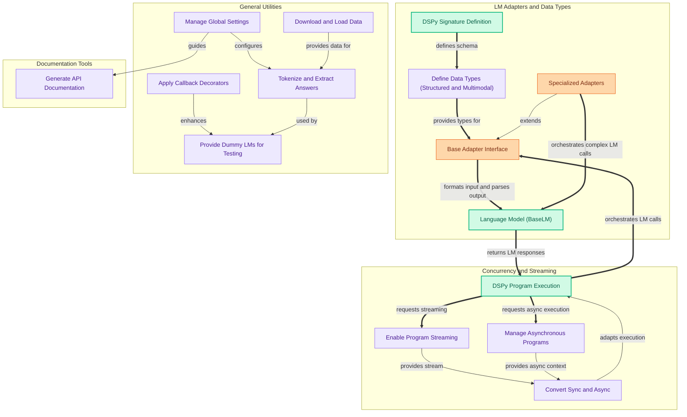

The `utilities_and_adapters` module provides essential infrastructure for DSPy, offering a robust set of tools for seamless integration with Language Models, flexible data type definitions, efficient management of asynchronous and streaming operations, and general-purpose utilities for program development and documentation. It empowers users to extend DSPy's capabilities, handle diverse data formats, and control execution flow with ease.

### How Components Work Together

The module's components are organized into four main functional areas: LM Adapters and Data Types, Concurrency and Streaming, General Utilities, and Documentation Tools.

### Core Components Documentation

*   **Base Adapter Interface**: Defines the foundational interface and core logic for transforming DSPy inputs into LM prompts and parsing LM outputs back into structured data.
    *   [`dspy.adapters.base.Adapter`](dspy/adapters/base.md)
*   **Specialized Adapters**: Provides advanced adapter implementations like `BAMLAdapter` for enhanced Pydantic model rendering and `TwoStepAdapter` for multi-stage LM interactions and structured data extraction.
    *   [`dspy.adapters.baml_adapter.BAMLAdapter`](dspy/adapters/baml_adapter.md)
    *   [`dspy.adapters.two_step_adapter.TwoStepAdapter`](dspy/adapters/two_step_adapter.md)
*   **Data Type Definitions**: Defines base types for custom data, citation handling, and tool definitions, including schema validation and formatting for language model interaction.
    *   [`dspy.adapters.types.base_type.Type`](dspy/adapters/types/base_type.md)
    *   [`dspy.adapters.types.citation`](dspy/adapters/types/citation.md)
    *   [`dspy.adapters.types.tool.Tool`](dspy/adapters/types/tool.md)
    *   [`dspy.adapters.types.audio.Audio`](dspy/adapters/types/audio.md)
    *   [`dspy.adapters.types.image.Image`](dspy/adapters/types/image.md)
*   **Asynchronous Program Management**: Offers functions for launching, managing, and controlling concurrency for asynchronous DSPy programs.
    *   [`dspy.utils.asyncify`](dspy/utils/asyncify.md)
*   **Program Streaming**: Provides utilities for streaming outputs from DSPy programs, including `streamify` and `StreamListener`.
    *   [`dspy.streaming.streamify`](dspy/streaming/streamify.md)
    *   [`dspy.streaming.streaming_listener.StreamListener`](dspy/streaming/streaming_listener.md)
*   **Sync/Async Conversion**: Facilitates conversion between synchronous and asynchronous execution models, managing concurrency and context.
    *   [`dspy.utils.syncify.SyncWrapper`](dspy/utils/syncify.md)
*   **Text Processing Utilities**: Includes tools for tokenization and locating answers within text.
    *   [`dspy.dsp.utils.dpr.SimpleTokenizer`](dspy/dsp/utils/dpr.md)
    *   [`dspy.dsp.utils.dpr.locate_answers`](dspy/dsp/utils/dpr.md)
*   **Global Settings Management**: Provides a centralized `Settings` class for managing global configurations.
    *   [`dspy.dsp.utils.settings.Settings`](dspy/dsp/utils/settings.md)
*   **File Operations**: Contains utilities for downloading files and loading batch backgrounds.
    *   [`dspy.utils.__init__.download`](dspy/utils/__init__.py.md)
    *   [`dspy.dsp.utils.utils.load_batch_backgrounds`](dspy/dsp/utils/utils.md)
*   **Callback Wrappers**: Offers decorators and wrappers for applying synchronous and asynchronous callbacks.
    *   [`dspy.utils.callback`](dspy/utils/callback.md)
*   **Dummy LM Implementations**: Provides dummy language model implementations for testing and development purposes.
    *   [`dspy.utils.dummies.DummyLM`](dspy/utils/dummies.md)
*   **API Documentation Generation**: Contains scripts for automating the generation of API documentation from source code.
    *   [`docs.scripts.generate_api_docs.generate_md_docs`](docs/scripts/generate_api_docs.md)