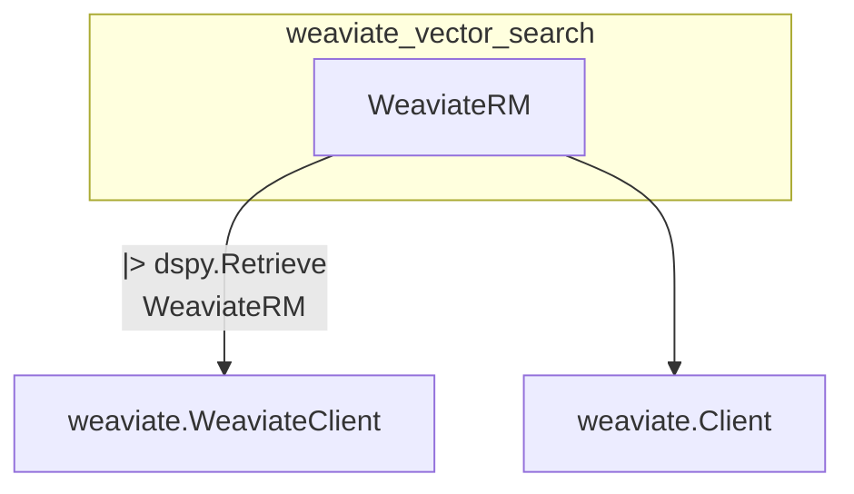

# weaviate_vector_search
The `weaviate_vector_search` module provides `WeaviateRM`, a DSPy retrieval module that integrates with Weaviate to fetch relevant passages. It supports both Weaviate v3 and v4 clients for flexible database connections.

<!-- DIAGRAM_JSON
{
  "nodes": [
    {"id": "WeaviateRM", "label": "WeaviateRM", "type": "class"},
    {"id": "dspy.Retrieve", "label": "dspy.Retrieve", "type": "class"},
    {"id": "weaviate.WeaviateClient", "label": "weaviate.WeaviateClient", "type": "class"},
    {"id": "weaviate.Client", "label": "weaviate.Client", "type": "class"}
  ],
  "edges": [
    {"source": "WeaviateRM", "target": "dspy.Retrieve", "label": "inherits"},
    {"source": "WeaviateRM", "target": "weaviate.WeaviateClient", "label": "uses"},
    {"source": "WeaviateRM", "target": "weaviate.Client", "label": "uses"}
  ],
  "groups": [
    {"id": "weaviate_vector_search_module", "label": "weaviate_vector_search", "nodes": ["WeaviateRM"]}
  ]
}
-->
