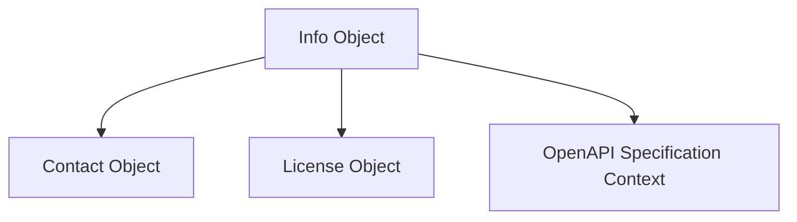

# `api_info_and_license` Module Documentation

## Introduction

The `api_info_and_license` module is a critical component within the OpenAPI model definitions, specifically responsible for encapsulating the essential metadata and licensing information of an API. This module ensures that API documentation provides clear and comprehensive details about the API's purpose, contact information, and legal terms.

## Purpose and Core Functionality

This module defines the data structures for the `Info` and `License` objects, which are fundamental parts of the OpenAPI Specification. It allows developers to specify:

*   **API Information (`Info`):** This includes the API's title, a brief description, and its version. It also allows embedding contact information.
*   **Contact Information (`Contact`):** Details about the API's maintainer or organization, including their name, URL, and email address.
*   **Licensing Details (`License`):** Information about the license under which the API is distributed, typically including the license name and a URL to the full license text.

These components collectively enable the generation of rich and informative API documentation, helping consumers understand the API's context and usage terms.

## Architecture and Component Relationships

The `api_info_and_license` module primarily consists of three core components, all of which are Pydantic models designed to align with the OpenAPI Specification:

*   **`Info`:** The central object for API metadata. It acts as a container for general API details and includes references to the `Contact` and `License` objects.
*   **`Contact`:** A sub-component used by the `Info` object to provide structured contact details.
*   **`License`:** Another sub-component used by the `Info` object to define the API's licensing information.

The relationships highlight how the `Info` object aggregates `Contact` and `License` details to form a complete metadata block for the API.

## How it Fits into the Overall System

The `api_info_and_license` module is nested within the `openapi_models_module`, specifically under `api_structure` and `api_metadata`. Its role is to provide the concrete data structures for the `info` and `license` fields that appear at the root level of an OpenAPI document. This integration is crucial for building a complete and valid OpenAPI specification, which in turn drives API documentation generation, client SDK creation, and API gateway configurations.

It works in conjunction with other modules within `openapi_models_module` to form a comprehensive representation of an API's definition. For a broader understanding of how these models contribute to the overall OpenAPI structure, refer to the [openapi_models_module documentation](openapi_models_module.md).

<!-- DIAGRAM_JSON
{
    "direction": "TD",
    "nodes": [
        {"id": "info_obj", "label": "Info Object", "type": "component", "link": null},
        {"id": "contact_obj", "label": "Contact Object", "type": "component", "link": null},
        {"id": "license_obj", "label": "License Object", "type": "component", "link": null},
        {"id": "openapi_spec", "label": "OpenAPI Specification Context", "type": "external", "link": "openapi_models_module.md"}
    ],
    "edges": [
        {"source": "info_obj", "target": "contact_obj"},
        {"source": "info_obj", "target": "license_obj"},
        {"source": "info_obj", "target": "openapi_spec"}
    ],
    "groups": []
}
-->
