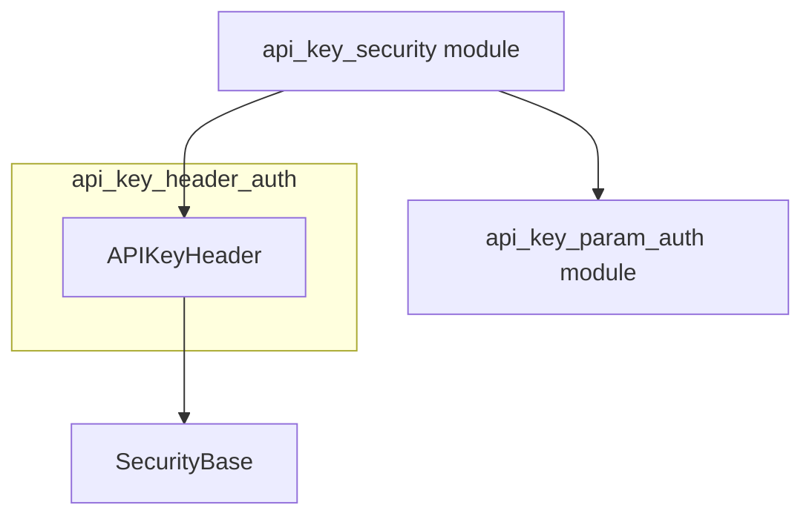

# `api_key_header_auth` Module Documentation

## Introduction

The `api_key_header_auth` module provides a mechanism for securing API endpoints by requiring an API key to be present in the HTTP headers of incoming requests. It leverages the `APIKeyHeader` security scheme to integrate seamlessly with FastAPI applications, offering a straightforward way to implement API key authentication.

## Purpose and Core Functionality

The primary purpose of this module is to enable API key authentication where the key is expected in a specific HTTP header. The core component, `APIKeyHeader`, is a security utility that:

*   **Extracts API Keys:** Automatically looks for the API key in a designated HTTP header (e.g., `X-API-Key`).
*   **Dependency Injection:** Works as a FastAPI dependency, allowing route functions to easily declare their requirement for an API key.
*   **Security Scheme Definition:** Defines the necessary OpenAPI security scheme for API key authentication in headers, making it discoverable by API documentation tools.

This module simplifies the process of securing endpoints by abstracting the details of header inspection and validation, ensuring that only requests with valid API keys can access protected resources.

## Architecture and Component Relationships

The `api_key_header_auth` module is a focused component within the broader [api_key_security.md](api_key_security.md) sub-system. Its main component, `APIKeyHeader`, is an implementation of a [security_base_concepts.md](security_base_concepts.md) concept, specifically designed for header-based API key authentication.

*   **`APIKeyHeader`**: The central component of this module. It inherits from `SecurityBase` (found in [security_base_concepts.md](security_base_concepts.md)) and is responsible for defining and implementing the logic for extracting and validating API keys from HTTP headers.

This module complements [api_key_param_auth.md](api_key_param_auth.md), which handles API key authentication via query parameters or cookies. Both modules provide distinct but related methods for API key-based security, falling under the umbrella of `api_key_security`.

## How the Module Fits into the Overall System

The `api_key_header_auth` module plays a crucial role in the overall security architecture by providing a standardized and easily deployable method for API key authentication. It integrates with FastAPI's dependency injection system, allowing developers to apply header-based API key security to any endpoint with minimal code.

By leveraging `APIKeyHeader`, the system can enforce access control at the API gateway or individual endpoint level, ensuring that services are protected from unauthorized access when an API key in the header is the chosen authentication mechanism. It works in conjunction with other security modules (like `api_key_param_auth` for different key locations) to offer a flexible and comprehensive security framework.

<!-- DIAGRAM_JSON
{
    "direction": "TD",
    "nodes": [
        {"id": "api_key_header", "label": "APIKeyHeader", "type": "component", "link": null},
        {"id": "security_base", "label": "SecurityBase", "type": "external", "link": "security_base_concepts.md"},
        {"id": "api_key_security", "label": "api_key_security module", "type": "external", "link": "api_key_security.md"},
        {"id": "api_key_param_auth", "label": "api_key_param_auth module", "type": "external", "link": "api_key_param_auth.md"}
    ],
    "edges": [
        {"source": "api_key_header", "target": "security_base"},
        {"source": "api_key_security", "target": "api_key_header"},
        {"source": "api_key_security", "target": "api_key_param_auth"}
    ],
    "groups": [
        {"id": "current_module", "label": "api_key_header_auth", "nodes": ["api_key_header"]}
    ]
}
-->
