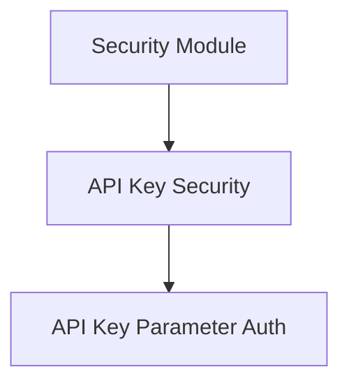

# API Key Parameter Authentication Module (`api_key_param_auth`)

## Introduction
The `api_key_param_auth` module provides mechanisms for securing API endpoints using API keys passed as query parameters or in cookies. This module is a specialized part of the broader `api_key_security` within the `security_module`, focusing on these specific delivery methods for API keys. It leverages FastAPI's dependency injection system to validate and extract API keys from incoming requests.

## Architecture Overview
The `api_key_param_auth` module is a sub-module of `api_key_security`, which in turn is part of the `security_module`. It directly interacts with incoming HTTP requests to extract API keys.

<!-- DIAGRAM_JSON
{
    "direction": "TD",
    "nodes": [
        {"id": "security_module", "label": "Security Module", "type": "external", "link": "security_module.md"},
        {"id": "api_key_security", "label": "API Key Security", "type": "external", "link": "api_key_security.md"},
        {"id": "api_key_param_auth", "label": "API Key Parameter Auth", "type": "module", "link": "api_key_param_auth.md"}
    ],
    "edges": [
        {"source": "security_module", "target": "api_key_security"},
        {"source": "api_key_security", "target": "api_key_param_auth"}
    ],
    "groups": []
}
-->

## Core Functionality

This module encapsulates two primary components for API key authentication: `APIKeyQuery` and `APIKeyCookie`.

### APIKeyQuery
The `APIKeyQuery` component is designed to extract API keys from the query parameters of an HTTP request. When integrated into a FastAPI path operation, it automatically looks for a specified query parameter (e.g., `?api_key=your_key`) and provides its value for authentication. This is suitable for scenarios where API keys can be exposed in URLs, typically for non-sensitive public APIs or internal services.

### APIKeyCookie
The `APIKeyCookie` component handles the retrieval of API keys stored in HTTP cookies. This method offers a more secure way to transmit API keys compared to query parameters, as cookies are typically managed by the browser and are not directly visible in the URL. It's often used for browser-based applications where the API key can be set in a cookie by a login process.

## How it Fits into the Overall System
The `api_key_param_auth` module provides specific implementations for API key authentication strategies. It is used by applications that need to secure endpoints using API keys delivered via URL query parameters or HTTP cookies. It integrates seamlessly with FastAPI's dependency injection, allowing developers to easily add API key protection to their routes by simply declaring an `APIKeyQuery` or `APIKeyCookie` dependency. This module contributes to the overall security framework by providing flexible and easy-to-use authentication methods.