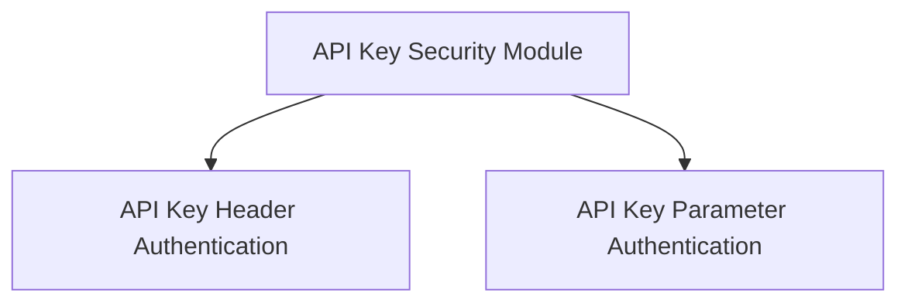

# `api_key_security` Module Documentation

## Introduction

The `api_key_security` module provides essential tools for implementing API key-based authentication within applications, particularly designed to integrate seamlessly with FastAPI's security dependencies. It offers flexible ways to retrieve API keys from different parts of an HTTP request, ensuring robust and adaptable security mechanisms.

## Architecture Overview

The module is structured to differentiate between common methods of API key delivery: via HTTP headers, query parameters, or cookies. Each method is encapsulated within dedicated sub-modules, allowing for clear separation of concerns and maintainable security configurations.

<!-- DIAGRAM_JSON
{
    "direction": "TD",
    "nodes": [
        {"id": "api_key_security_module", "label": "API Key Security", "type": "module"},
        {"id": "api_key_header_auth", "label": "API Key Header Authentication", "type": "module", "link": "api_key_header_auth.md"},
        {"id": "api_key_param_auth", "label": "API Key Parameter Authentication", "type": "module", "link": "api_key_param_auth.md"}
    ],
    "edges": [
        {"source": "api_key_security_module", "target": "api_key_header_auth"},
        {"source": "api_key_security_module", "target": "api_key_param_auth"}
    ],
    "groups": []
}
-->

## Sub-modules

### API Key Header Authentication

This sub-module, documented in [`api_key_header_auth.md`](api_key_header_auth.md), is responsible for handling API keys supplied within HTTP request headers. It provides the necessary components to extract and validate API keys when they are passed in this manner.

### API Key Parameter Authentication

Detailed in [`api_key_param_auth.md`](api_key_param_auth.md), this sub-module focuses on API key authentication where keys are provided either as query parameters in the URL or as values in request cookies. It encapsulates the logic for processing these parameter-based API keys.

