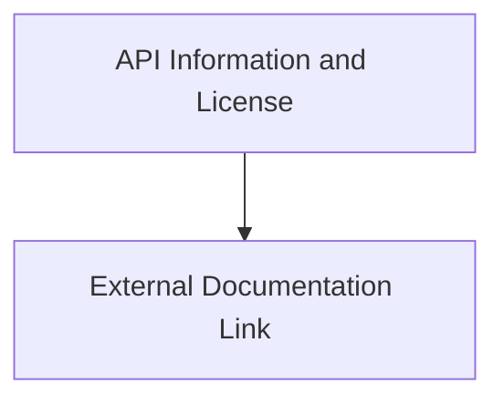

# `api_metadata` Module Documentation

## Introduction
The `api_metadata` module is responsible for defining the essential metadata that describes an OpenAPI specification. It encompasses core information about the API, its maintainers, licensing terms, and references to additional external documentation, providing a comprehensive overview for consumers and developers.

## Architecture Overview
The `api_metadata` module is composed of two main sub-modules, which logically separate the API's descriptive information from its external documentation links.

<!-- DIAGRAM_JSON
{
    "direction": "TD",
    "nodes": [
        {"id": "api_info_and_license", "label": "API Information and License", "type": "module", "link": "api_info_and_license.md"},
        {"id": "external_documentation_link", "label": "External Documentation Link", "type": "module", "link": "external_documentation_link.md"}
    ],
    "edges": [
        {"source": "api_info_and_license", "target": "external_documentation_link"}
    ],
    "groups": []
}
-->

## Sub-modules:

*   **[API Information and License](api_info_and_license.md)**: This sub-module defines the core informational elements of the API, including general API details, contact information, and applicable licenses.
*   **[External Documentation Link](external_documentation_link.md)**: This sub-module handles the referencing of external documentation that provides further context or details about the API.
