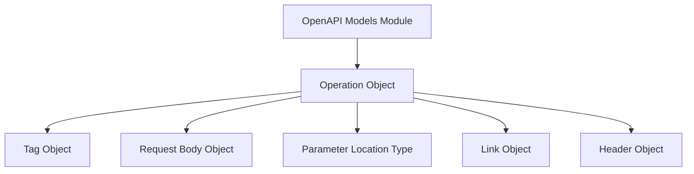

# api_operations Module Documentation

## Introduction
The `api_operations` module is a crucial part of the `openapi_models_module`, specifically focusing on defining the intricate details of individual API operations within the OpenAPI Specification. It encapsulates components like `Operation`, `Tag`, `RequestBody`, `ParameterInType`, `Link`, and `Header`, which collectively describe how an API endpoint behaves, its input and output, and its metadata.

## Core Functionality and Components

The `api_operations` module provides the foundational structures for describing API endpoints. Each core component plays a distinct role:

*   **Operation**: This is the central object, representing a single API endpoint (e.g., GET /users/{id}, POST /items). It aggregates all the other components to provide a complete definition of an API action, including its parameters, request body, responses, security, and metadata.
*   **Tag**: Used for logical grouping of related operations. Tags help organize and categorize API endpoints in documentation and UI tools, improving discoverability and navigation.
*   **RequestBody**: Defines the structure and content of the request body for an operation, including media types, schemas, and examples. It describes the data clients send to the API.
*   **ParameterInType**: An enumeration or definition that specifies the location of an API parameter within a request (e.g., `query`, `header`, `path`, `cookie`). This is used in conjunction with a `Parameter` object (defined elsewhere within `openapi_models_module`) to fully describe an API parameter.
*   **Link**: Describes a relationship between an operation's response and another operation. Links enable clients to navigate between related API resources and actions, facilitating hypermedia-driven APIs.
*   **Header**: Defines an HTTP header that can be used for various purposes, such as defining request or response headers, or within security schemes.

## Architecture and Component Relationships

The `api_operations` module's architecture is centered around the `Operation` object, which acts as a container for various other components that describe an API's behavior.

<!-- DIAGRAM_JSON
{
    "direction": "TD",
    "nodes": [
        {"id": "operation", "label": "Operation Object", "type": "component", "link": null},
        {"id": "tag", "label": "Tag Object", "type": "component", "link": null},
        {"id": "request_body", "label": "Request Body Object", "type": "component", "link": null},
        {"id": "parameter_in_type", "label": "Parameter Location Type", "type": "component", "link": null},
        {"id": "link", "label": "Link Object", "type": "component", "link": null},
        {"id": "header", "label": "Header Object", "type": "component", "link": null},
        {"id": "openapi_models_module", "label": "OpenAPI Models Module", "type": "external", "link": "openapi_models_module.md"}
    ],
    "edges": [
        {"source": "operation", "target": "tag"},
        {"source": "operation", "target": "request_body"},
        {"source": "operation", "target": "parameter_in_type"},
        {"source": "operation", "target": "link"},
        {"source": "operation", "target": "header"},
        {"source": "openapi_models_module", "target": "operation"}
    ],
    "groups": []
}
-->

*   **Operation Object**: This is the primary component, encapsulating all the details for a single API endpoint.
*   **Relationships with other components**: An `Operation` can be associated with `Tag` objects for categorization, include a `RequestBody` to define its input, reference `ParameterInType` for its parameters, define `Link` objects for hypermedia, and specify `Header` objects for requests or responses.

## How it Fits into the Overall System

The `api_operations` module is a fundamental building block within the larger [openapi_models_module](openapi_models_module.md). It specifically contributes to the `api_structure` part of the OpenAPI specification, which defines how API paths and their associated operations are structured.

By providing detailed definitions for `Operation` objects and their related components, `api_operations` enables the comprehensive description of an API's functionality. This information is then consumed by various tools for:

*   **Documentation Generation**: Creating human-readable API documentation.
*   **Client SDK Generation**: Automatically generating client libraries for different programming languages.
*   **Server Stub Generation**: Generating server-side boilerplate code.
*   **API Gateway Configuration**: Configuring API gateways with routing and validation rules.
*   **Testing and Validation**: Facilitating automated testing and schema validation.

In essence, `api_operations` translates the functional aspects of an API endpoint into a machine-readable and standardized format, making the API more discoverable, consumable, and maintainable within a larger ecosystem.
