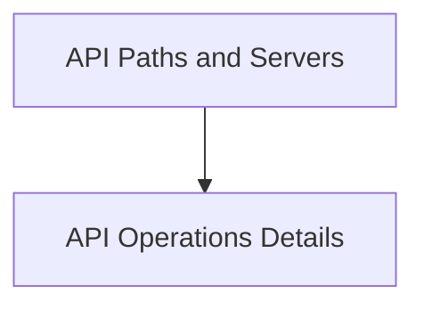

# `api_path_and_operations` Module Documentation

## Introduction
This module is responsible for defining the core structures related to API paths, individual operations (GET, POST, etc.), and their associated elements within the OpenAPI specification. It provides the building blocks for detailing how an API can be accessed and interacted with.

## Architecture Overview
The `api_path_and_operations` module is composed of two primary sub-modules that collaboratively define the API structure.

<!-- DIAGRAM_JSON
{
    "direction": "TD",
    "nodes": [
        {"id": "api_operations", "label": "API Operations Details", "type": "module", "link": "api_operations.md"},
        {"id": "api_paths_and_servers", "label": "API Paths and Servers", "type": "module", "link": "api_paths_and_servers.md"}
    ],
    "edges": [
        {"source": "api_paths_and_servers", "target": "api_operations"}
    ],
    "groups": []
}
-->

## Sub-modules

### API Operations Details ([api_operations.md](api_operations.md))
This sub-module defines the granular details of API operations, including their parameters, request bodies, responses, and linking mechanisms.

### API Paths and Servers ([api_paths_and_servers.md](api_paths_and_servers.md))
This sub-module focuses on defining the available paths for an API and the server information where the API is hosted.