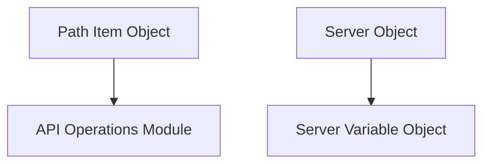

# API Paths and Servers Module

The `api_paths_and_servers` module is a crucial part of the OpenAPI specification's structural definition, focusing on how API endpoints and server information are described. It provides the foundational components for defining individual API paths and the servers that host them.

## Core Functionality

This module encapsulates the following core components, which are essential for detailing the structure of an API and its deployment environments:

*   **`PathItem`**: Represents a single API path, typically a relative path to the target host. A `PathItem` object can describe the operations available on that path (GET, POST, PUT, DELETE, etc.) and is a key component for structuring the API surface.
*   **`Server`**: Defines a single server endpoint that an API client can target. It includes a URL and an optional description, along with variables that can be used for URL templating.
*   **`ServerVariable`**: Provides metadata for a single variable used in a `Server` object's URL template. This allows for dynamic server URLs based on predefined values or user input.

## Architecture and Component Relationships

The `api_paths_and_servers` module works in conjunction with other modules within the `openapi_models` package, particularly those defining API operations. It establishes the canvas upon which specific API operations are drawn.

<!-- DIAGRAM_JSON
{
    "direction": "TD",
    "nodes": [
        {"id": "path_item", "label": "Path Item Object", "type": "component", "link": null},
        {"id": "server", "label": "Server Object", "type": "component", "link": null},
        {"id": "server_variable", "label": "Server Variable Object", "type": "component", "link": null},
        {"id": "api_operations", "label": "API Operations Module", "type": "external", "link": "api_operations.md"}
    ],
    "edges": [
        {"source": "path_item", "target": "api_operations"},
        {"source": "server", "target": "server_variable"}
    ],
    "groups": []
}
-->

## How it Fits into the Overall System

This module is a fundamental part of the OpenAPI document structure. `PathItem` objects define the individual endpoints of an API, acting as containers for the various operations (GET, POST, etc.) that can be performed at that path. These operations are further detailed in the [api_operations module](api_operations.md). The `Server` and `ServerVariable` components allow for flexible and dynamic definition of the API's deployment environments, enabling clients to interact with different instances of the API based on configuration.

Together, these components provide a comprehensive way to describe the entry points and hosting details of an API, making them discoverable and usable by developers and automated tools.