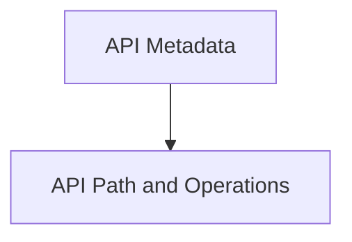

# API Structure Module Documentation

The `api_structure` module is a crucial component within the `openapi_models_module`, defining the fundamental building blocks for describing the structure and metadata of an OpenAPI (Swagger) specification. It provides classes and enums that represent various aspects of an API, such as information about the API itself, definitions for paths, operations, parameters, request bodies, and external documentation.

This module ensures a standardized and machine-readable description of RESTful APIs, enabling automated tools for documentation generation, client SDK creation, and API testing.

## Architecture Overview

The `api_structure` module is logically divided into two primary sub-modules:

<!-- DIAGRAM_JSON
{
    "direction": "TD",
    "nodes": [
        {"id": "api_metadata", "label": "API Metadata", "type": "module", "link": "api_metadata.md"},
        {"id": "api_path_and_operations", "label": "API Path and Operations", "type": "module", "link": "api_path_and_operations.md"}
    ],
    "edges": [
        {"source": "api_metadata", "target": "api_path_and_operations"}
    ],
    "groups": []
}
-->

## Sub-modules

### [API Metadata](api_metadata.md)

This sub-module encapsulates components related to the overarching information and descriptive elements of the API. It includes definitions for the API's title, version, contact information, licensing details, and links to external documentation. These components are essential for providing human-readable context and legal information about the API.

### [API Path and Operations](api_path_and_operations.md)

This sub-module focuses on the detailed structure of the API's endpoints and the operations that can be performed on them. It defines how individual paths are described, the HTTP methods (operations) supported, request bodies, parameters that can be passed, and ways to tag and link operations. These components are critical for defining the functional interface of the API.