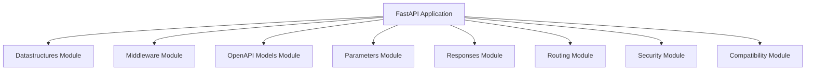

# applications_module Documentation

## Introduction

The `applications_module` serves as the core of the web application, leveraging the **FastAPI** framework to provide robust and high-performance API services. It orchestrates various functionalities such as request handling, routing, response generation, security, and OpenAPI documentation, making it central to the system's operation.

## Architecture and Component Relationships

This module primarily exposes the FastAPI application instance, which acts as the central hub for handling incoming HTTP requests and dispatching them to appropriate handlers. It integrates deeply with several other modules to provide a comprehensive API solution.

### Core Component: `FastAPI`

-   **Purpose**: The `FastAPI` instance is the main application object that defines routes, handles dependencies, applies middleware, and generates OpenAPI schema.

### Dependencies

The `applications_module` (specifically the `FastAPI` component) relies on the following modules:

*   **[datastructures_module](datastructures_module.md)**: Utilized for handling complex data structures, such as file uploads (`UploadFile`).
*   **[middleware_module](middleware_module.md)**: Integrates various middleware components, like `AsyncExitStackMiddleware`, to process requests and responses globally.
*   **[openapi_models_module](openapi_models_module.md)**: Essential for generating the OpenAPI (formerly Swagger) documentation, including models for schemas, parameters, security schemes, and other OpenAPI specification elements.
*   **[params_module](params_module.md)**: Used for defining and validating various request parameters (`ParamTypes`), enabling robust input validation.
*   **[responses_module](responses_module.md)**: Provides utilities for constructing different types of responses, such as `UJSONResponse` for efficient JSON serialization.
*   **[routing_module](routing_module.md)**: Manages the API's routing mechanism, defining how incoming requests are mapped to specific handler functions via `APIRoute`.
*   **[security_module](security_module.md)**: Implements various security schemes, including API key authentication (`APIKeyCookie`, `APIKeyQuery`, `APIKeyHeader`), HTTP authentication (`HTTPBasic`, `HTTPBearer`, `HTTPDigest`), and OAuth2 mechanisms (`OAuth2PasswordBearer`).
*   **[compat_module](compat_module.md)**: Provides compatibility utilities, potentially including base configurations (`BaseConfig`) for different environments or frameworks.

<!-- DIAGRAM_JSON
{
    "direction": "TD",
    "nodes": [
        {"id": "fastapi_app", "label": "FastAPI Application", "type": "component", "link": null},
        {"id": "datastructures_module", "label": "Datastructures Module", "type": "external", "link": "datastructures_module.md"},
        {"id": "middleware_module", "label": "Middleware Module", "type": "external", "link": "middleware_module.md"},
        {"id": "openapi_models_module", "label": "OpenAPI Models Module", "type": "external", "link": "openapi_models_module.md"},
        {"id": "params_module", "label": "Parameters Module", "type": "external", "link": "params_module.md"},
        {"id": "responses_module", "label": "Responses Module", "type": "external", "link": "responses_module.md"},
        {"id": "routing_module", "label": "Routing Module", "type": "external", "link": "routing_module.md"},
        {"id": "security_module", "label": "Security Module", "type": "external", "link": "security_module.md"},
        {"id": "compat_module", "label": "Compatibility Module", "type": "external", "link": "compat_module.md"}
    ],
    "edges": [
        {"source": "fastapi_app", "target": "datastructures_module"},
        {"source": "fastapi_app", "target": "middleware_module"},
        {"source": "fastapi_app", "target": "openapi_models_module"},
        {"source": "fastapi_app", "target": "params_module"},
        {"source": "fastapi_app", "target": "responses_module"},
        {"source": "fastapi_app", "target": "routing_module"},
        {"source": "fastapi_app", "target": "security_module"},
        {"source": "fastapi_app", "target": "compat_module"}
    ],
    "groups": []
}
-->

## How it Fits into the Overall System

The `applications_module` is the entry point for all API requests. It initializes the FastAPI application, registers all necessary routes, applies global middleware, and configures security. It acts as the orchestrator that brings together functionalities from various other modules to serve the application's API endpoints. Any external client interacting with the system will communicate directly with the API exposed by this module.