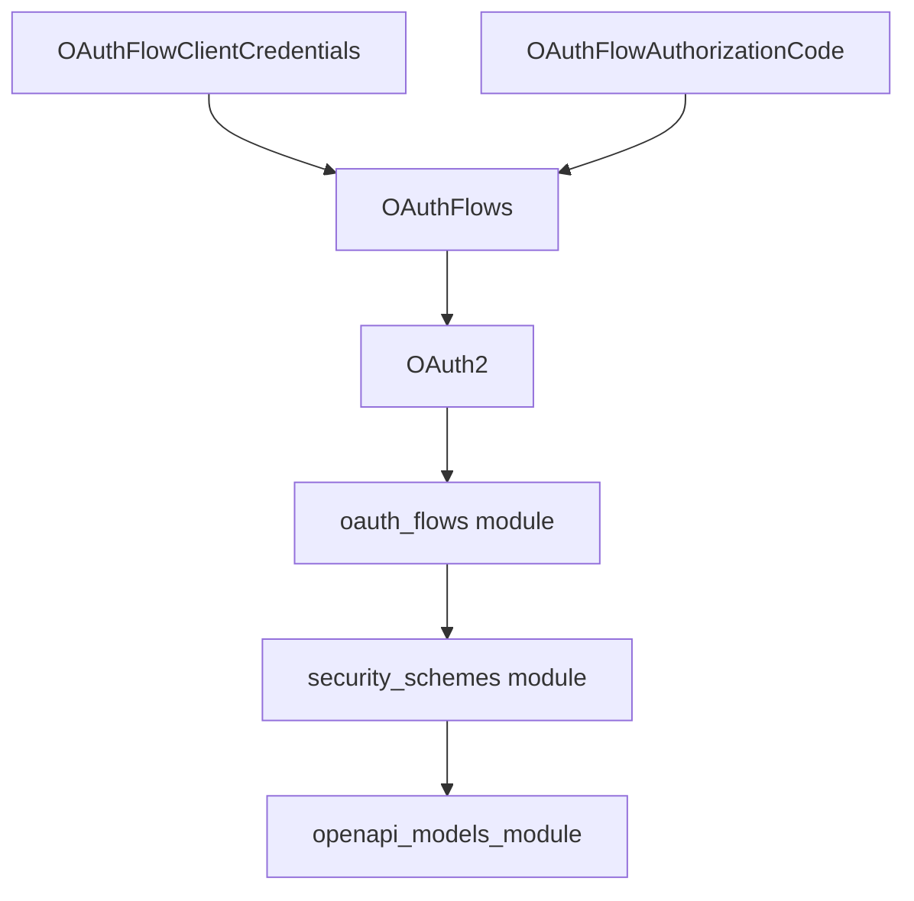

# client_credentials_and_auth_code_flows

## Introduction

The `client_credentials_and_auth_code_flows` module is a vital component within the `openapi_models` ecosystem, specifically designed to define the data structures for the OAuth 2.0 Client Credentials and Authorization Code flows as part of an OpenAPI specification. It provides the OpenAPI-compliant models necessary to describe how these security mechanisms are configured for an API.

## Architecture and Component Relationships

This module contains the definitions for two key OpenAPI models related to OAuth 2.0 flows: `OAuthFlowClientCredentials` and `OAuthFlowAuthorizationCode`. These models are utilized within the broader `oauth_flows` module to specify the different types of OAuth 2.0 flows supported by an API's security scheme.

### Core Components

*   **OAuthFlowClientCredentials**: This component defines the properties for the OAuth 2.0 Client Credentials flow. It typically includes fields such as `tokenUrl` (the URL of the token endpoint) and `scopes` (a map of scope names to their descriptions).
*   **OAuthFlowAuthorizationCode**: This component defines the properties for the OAuth 2.0 Authorization Code flow. It typically includes fields such as `authorizationUrl` (the URL of the authorization endpoint), `tokenUrl` (the URL of the token endpoint), and `scopes` (a map of scope names to their descriptions).

### Module Dependencies

This module's components are integral to the `OAuthFlows` model, which is defined in the [oauth_flow_definitions.md](oauth_flow_definitions.md) module. The `OAuthFlows` model, in turn, is a part of the `OAuth2` security scheme, also defined in [oauth_flow_definitions.md]. These security schemes are ultimately aggregated and managed by the [security_schemes.md](security_schemes.md) module, which is a sub-module of [openapi_models_module.md](openapi_models_module.md).

## System Integration

The `client_credentials_and_auth_code_flows` module plays a crucial role in the overall API documentation generation process. By providing standardized models for OAuth 2.0 flows, it ensures that an API's security requirements are accurately and comprehensively described in the generated OpenAPI specification. This allows developers to easily understand and implement authentication mechanisms when interacting with the API. The definitions from this module are consumed by higher-level OpenAPI components to construct the complete API specification.

<!-- DIAGRAM_JSON
{
    "direction": "TD",
    "nodes": [
        {"id": "oauth_flow_client_credentials", "label": "OAuthFlowClientCredentials", "type": "component", "link": null},
        {"id": "oauth_flow_authorization_code", "label": "OAuthFlowAuthorizationCode", "type": "component", "link": null},
        {"id": "oauth_flows", "label": "OAuthFlows", "type": "external", "link": "oauth_flow_definitions.md"},
        {"id": "oauth2", "label": "OAuth2", "type": "external", "link": "oauth_flow_definitions.md"},
        {"id": "oauth_flows_module", "label": "oauth_flows module", "type": "external", "link": "oauth_flows.md"},
        {"id": "security_schemes_module", "label": "security_schemes module", "type": "external", "link": "security_schemes.md"},
        {"id": "openapi_models_module", "label": "openapi_models_module", "type": "external", "link": "openapi_models_module.md"}
    ],
    "edges": [
        {"source": "oauth_flow_client_credentials", "target": "oauth_flows"},
        {"source": "oauth_flow_authorization_code", "target": "oauth_flows"},
        {"source": "oauth_flows", "target": "oauth2"},
        {"source": "oauth2", "target": "oauth_flows_module"},
        {"source": "oauth_flows_module", "target": "security_schemes_module"},
        {"source": "security_schemes_module", "target": "openapi_models_module"}
    ],
    "groups": []
}
-->

