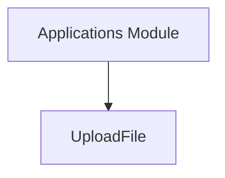

# `datastructures_module`

## Introduction

The `datastructures_module` is a critical component of the system, primarily responsible for defining and managing fundamental data structures used throughout the application. Its core functionality revolves around facilitating robust data handling, especially for file uploads.

## Core Functionality

### `UploadFile`

The `UploadFile` component provides a standard and efficient way to handle uploaded files in web applications. It abstracts away the complexities of file I/O, allowing developers to easily access file content, metadata, and perform operations on uploaded files.

**Key Features:**

*   **Asynchronous File Handling:** Designed to work seamlessly with asynchronous frameworks, enabling non-blocking file operations.
*   **Metadata Access:** Provides access to essential file metadata such as filename, content type, and file size.
*   **Temporary Storage Management:** Handles the temporary storage of uploaded files, ensuring proper cleanup after processing.
*   **Streamlined Integration:** Integrates smoothly with request handling processes, particularly in modules like `applications_module` for processing incoming requests.

## Architecture and Component Relationships

This module defines foundational data structures that are consumed by other modules to ensure consistent data representation and interaction. `UploadFile` is typically used by the `applications_module` (which uses FastAPI) to process files sent in HTTP requests.

<!-- DIAGRAM_JSON
{
    "direction": "TD",
    "nodes": [
        {"id": "upload_file", "label": "UploadFile", "type": "component", "link": null},
        {"id": "applications_module", "label": "Applications Module", "type": "external", "link": "applications_module.md"}
    ],
    "edges": [
        {"source": "applications_module", "target": "upload_file"}
    ],
    "groups": []
}
-->

## How the Module Fits into the Overall System

The `datastructures_module` serves as a foundational layer, providing essential data structures that enable other parts of the system to function correctly. Specifically, `UploadFile` is indispensable for any feature that involves receiving files from users, such as profile picture uploads, document submissions, or media content sharing. It ensures that file upload operations are handled securely, efficiently, and in a standardized manner across the application, integrating tightly with the request handling mechanisms provided by the [applications_module](applications_module.md).
