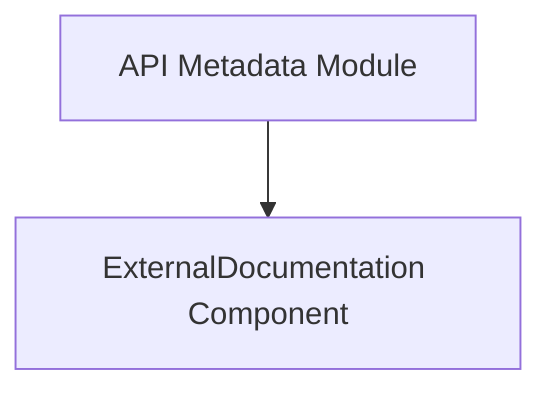

# External_documentation_link Module

## Introduction

The `external_documentation_link` module is a leaf module within the `openapi_models_module` structure, specifically nested under `api_structure` and `api_metadata`. Its primary function is to encapsulate the `ExternalDocumentation` component, which is crucial for linking to external resources in OpenAPI specifications.

## Purpose and Core Functionality

This module defines the `ExternalDocumentation` object, allowing API developers to provide links to external documentation, specifications, or other relevant resources from within their OpenAPI documentation. This enhances the comprehensiveness and navigability of the API documentation by pointing users to additional information beyond the main specification.

## Architecture and Component Relationships

The `external_documentation_link` module contains a single core component, `ExternalDocumentation`. This component defines the structure for an external documentation object, typically including fields for a description and a URL.

It is consumed by the `api_metadata` module, which aggregates various metadata components for the overall API specification. The `ExternalDocumentation` component itself does not have internal sub-components or dependencies within this module; it serves as a self-contained definition.

## How the Module Fits into the Overall System

The `external_documentation_link` module plays a vital role in enriching the metadata of an OpenAPI specification. By defining the `ExternalDocumentation` object, it enables the `api_metadata` module (and consequently the broader `openapi_models_module`) to incorporate external references. This is essential for large or complex APIs that require linking to external guides, tutorials, or supplementary documents, thus providing a more complete and useful developer experience.

<!-- DIAGRAM_JSON
{
    "direction": "TD",
    "nodes": [
        {"id": "external_doc_component", "label": "ExternalDocumentation Component", "type": "component", "link": null},
        {"id": "api_metadata_module", "label": "API Metadata Module", "type": "external", "link": "api_metadata.md"}
    ],
    "edges": [
        {"source": "api_metadata_module", "target": "external_doc_component"}
    ],
    "groups": []
}
-->

