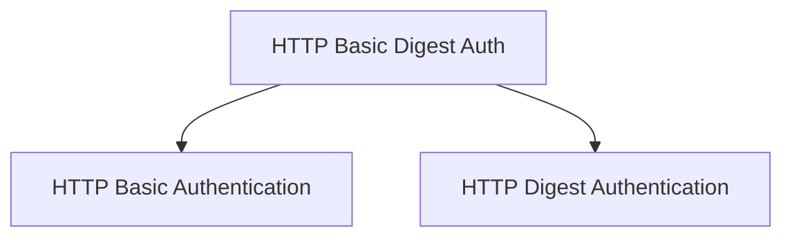

# HTTP Basic and Digest Authentication Module

## Introduction

The `http_basic_digest_auth` module provides robust implementations for both HTTP Basic and HTTP Digest authentication schemes. It is a core component within the larger `security_module`, specifically residing under `http_security`. This module enables applications to secure endpoints by requiring clients to provide credentials that are validated against these established HTTP authentication protocols.

## Architecture

The module is structured to provide clear separation of concerns for each authentication method, allowing for independent use and easier maintenance.

<!-- DIAGRAM_JSON
{
    "direction": "TD",
    "nodes": [
        {"id": "http_basic_auth", "label": "HTTP Basic Authentication", "type": "module", "link": "http_basic_auth.md"},
        {"id": "http_digest_auth", "label": "HTTP Digest Authentication", "type": "module", "link": "http_digest_auth.md"}
    ],
    "edges": [
        {"source": "http_basic_digest_auth", "target": "http_basic_auth"},
        {"source": "http_basic_digest_auth", "target": "http_digest_auth"}
    ],
    "groups": []
}
-->

## Sub-modules

### [HTTP Basic Authentication](http_basic_auth.md)
This sub-module encapsulates the logic for HTTP Basic authentication. It provides mechanisms to process and validate user credentials sent in the `Authorization` header using the Basic scheme.

### [HTTP Digest Authentication](http_digest_auth.md)
This sub-module handles the more secure HTTP Digest authentication. It includes functionality for generating nonces, computing response hashes, and verifying client credentials to protect against replay attacks and credential sniffing.

## Integration with Overall System

The `http_basic_digest_auth` module is a fundamental part of the `security_module`, offering essential authentication primitives. It can be integrated with various application layers, particularly within the `applications_module` (e.g., FastAPI) and `routing_module`, to secure API endpoints and resources. Its components are designed to be easily pluggable into middleware or route handlers, ensuring that only authenticated requests are processed.