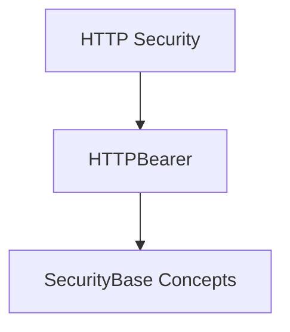

# http_bearer_auth Module Documentation

The `http_bearer_auth` module provides essential tools for implementing HTTP Bearer token authentication within the system. It primarily focuses on the `HTTPBearer` class, which facilitates the extraction and validation of Bearer tokens from incoming requests, ensuring secure access to protected resources.

## Core Functionality

The main component of this module is:

*   **`HTTPBearer`**: This class is a security dependency that allows defining HTTP Bearer token authentication. It inherits from `SecurityBase` (documented in [security_base_concepts.md](security_base_concepts.md)) and is designed to integrate seamlessly with frameworks like FastAPI to secure API endpoints. When used, it expects a `Bearer` token in the `Authorization` header of the request.

## Architecture and Component Relationships

The `http_bearer_auth` module is a leaf module within the `http_security` sub-module, which itself is part of the broader `security` module. Its simplicity stems from its focused responsibility: handling HTTP Bearer token extraction.

<!-- DIAGRAM_JSON
{
    "direction": "TD",
    "nodes": [
        {"id": "http_bearer", "label": "HTTPBearer", "type": "component", "link": null},
        {"id": "security_base_concepts", "label": "SecurityBase Concepts", "type": "external", "link": "security_base_concepts.md"},
        {"id": "http_security", "label": "HTTP Security", "type": "external", "link": "http_security.md"}
    ],
    "edges": [
        {"source": "http_bearer", "target": "security_base_concepts"},
        {"source": "http_security", "target": "http_bearer"}
    ],
    "groups": []
}
-->

## How the Module Fits into the Overall System

The `http_bearer_auth` module plays a crucial role in the system's authentication layer by providing a concrete implementation for HTTP Bearer token security. It is leveraged by higher-level modules, particularly those within the `applications_module` (e.g., FastAPI applications), to define and enforce security requirements for routes. By centralizing the logic for Bearer token handling, it promotes reusability and consistency in securing API endpoints.

This module integrates with:
*   **`security_base_concepts.md`**: Provides the foundational `SecurityBase` class from which `HTTPBearer` inherits.
*   **`http_security.md`**: As a sub-module, it contributes to the overall HTTP-related security mechanisms.
*   **`applications_module.md`**: FastAPI applications (from `applications_module`) utilize `HTTPBearer` to define security for their routes.
