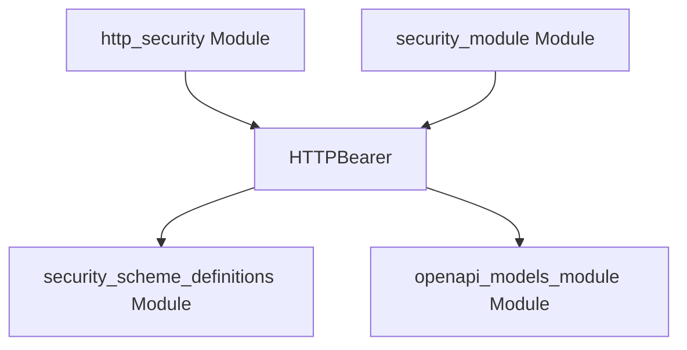

# http_bearer_scheme Module Documentation

## Introduction

The `http_bearer_scheme` module is a focused component responsible for defining the `HTTPBearer` class. This class is essential for accurately specifying HTTP Bearer authentication schemes within OpenAPI documentation, enabling robust and clear API security descriptions.

## Purpose and Core Functionality

This module's primary role is to encapsulate the definition of an HTTP Bearer security scheme. The `HTTPBearer` component provides the necessary structure to describe how API endpoints are secured using a Bearer token, most commonly a JSON Web Token (JWT). This definition is leveraged by OpenAPI (formerly Swagger) to generate comprehensive and interactive API documentation, as well as client SDKs that correctly handle authentication. It ensures that the API's security requirements for Bearer token authentication are clearly articulated in the OpenAPI specification.

## Architecture and Component Relationships

The `http_bearer_scheme` module, being a leaf module, focuses on the specific `HTTPBearer` definition. It interacts with several other modules that either consume its definition or provide foundational types.

<!-- DIAGRAM_JSON
{
    "direction": "TD",
    "nodes": [
        {"id": "httpbearer", "label": "HTTPBearer", "type": "component", "link": null},
        {"id": "http_security", "label": "http_security Module", "type": "external", "link": "http_security.md"},
        {"id": "security_scheme_definitions", "label": "security_scheme_definitions Module", "type": "external", "link": "security_scheme_definitions.md"},
        {"id": "openapi_models_module", "label": "openapi_models_module Module", "type": "external", "link": "openapi_models_module.md"},
        {"id": "security_module", "label": "security_module Module", "type": "external", "link": "security_module.md"}
    ],
    "edges": [
        {"source": "http_security", "target": "httpbearer"},
        {"source": "httpbearer", "target": "security_scheme_definitions"},
        {"source": "httpbearer", "target": "openapi_models_module"},
        {"source": "security_module", "target": "httpbearer"}
    ],
    "groups": []
}
-->

*   **HTTPBearer**: This is the core component provided by this module. It defines the structure and properties for an HTTP Bearer security scheme in the context of OpenAPI.
*   **[http_security](http_security.md)**: As the parent module, `http_security` groups various HTTP-related security schemes. It relies on `http_bearer_scheme` for the specific definition of HTTP Bearer authentication.
*   **[security_scheme_definitions](security_scheme_definitions.md)**: This module likely provides general definitions or base types for security schemes. `HTTPBearer` conceptually extends or utilizes these foundational types to establish its own specific characteristics.
*   **[openapi_models_module](openapi_models_module.md)**: The `openapi_models_module` is the overarching module that contains all OpenAPI specification models. `HTTPBearer` is an integral part of this larger structure, contributing a specific security mechanism.
*   **[security_module](security_module.md)**: While `http_bearer_scheme` defines the *schema* for HTTP Bearer authentication, the `security_module` is responsible for the *runtime implementation* of verifying and handling these tokens during API requests. It consumes the definition provided by `http_bearer_scheme` to configure actual security checks.

## How the Module Fits into the Overall System

The `http_bearer_scheme` module occupies a critical position as a leaf module within the `openapi_models_module`'s security definition hierarchy. It plays an indispensable role in enabling the generation of comprehensive and accurate OpenAPI documentation. By clearly defining the HTTP Bearer authentication method, it ensures that client developers can easily understand how to authenticate with the API using bearer tokens. Its definition is consumed by higher-level modules to construct the full OpenAPI specification, which in turn drives API client generation and interactive documentation. This module provides the declarative component, allowing other parts of the system to implement and document HTTP Bearer security consistently.
