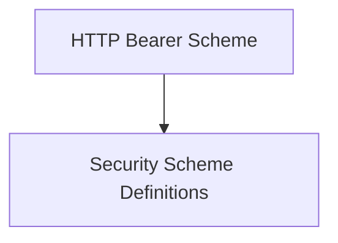

# HTTP Security Module

The `http_security` module is a crucial part of the [PLACEHOLDER_OPENAPI_MODELS] within the `security_schemes` sub-module, specifically designed to define and manage HTTP-based security mechanisms. It provides core components for specifying how client requests are authenticated and authorized using standard HTTP security schemes.

## Purpose

This module's primary purpose is to encapsulate the definitions for HTTP Bearer token authentication and the various types of API key input locations. It ensures that security schemes are properly represented in OpenAPI specifications, allowing for robust and standardized API security configurations.

## Architecture Overview

The `http_security` module is composed of two main sub-modules, each handling a specific aspect of HTTP security definition:

1.  **HTTP Bearer Scheme**: Defines the structure and usage of HTTP Bearer authentication.
2.  **Security Scheme Definitions**: Manages the enumeration of API key input types and general security scheme categories.

<!-- DIAGRAM_JSON
{
    "direction": "TD",
    "nodes": [
        {"id": "http_bearer_scheme", "label": "HTTP Bearer Scheme", "type": "module", "link": "http_bearer_scheme.md"},
        {"id": "security_scheme_definitions", "label": "Security Scheme Definitions", "type": "module", "link": "security_scheme_definitions.md"}
    ],
    "edges": [
        {"source": "http_bearer_scheme", "target": "security_scheme_definitions"}
    ],
    "groups": []
}
-->

## Sub-modules

### HTTP Bearer Scheme

This sub-module focuses on the `HTTPBearer` component, which defines how HTTP Bearer token authentication is described within OpenAPI. It specifies the expected format of the Authorization header for token-based authentication, ensuring consistency and interoperability with various authentication providers. For more details, refer to [http_bearer_scheme.md](http_bearer_scheme.md).

### Security Scheme Definitions

This sub-module includes `APIKeyIn` and `SecuritySchemeType` components. `APIKeyIn` enumerates the possible locations for an API key (e.g., in headers, query parameters, or cookies), while `SecuritySchemeType` provides a broad classification of security schemes (e.g., API key, HTTP, OAuth2, OpenID Connect). These definitions are fundamental for building flexible and comprehensive security configurations. For more details, refer to [security_scheme_definitions.md](security_scheme_definitions.md).

## Integration with Overall System

The `http_security` module, residing within the `openapi_models_module` and specifically the `security_schemes` sub-module, plays a critical role in defining the security aspects of an API. It provides the foundational components that other modules, such as those defining API routes and operations, use to declare their security requirements. This ensures that the generated OpenAPI documentation accurately reflects the security policies of the API, aiding client development and ensuring secure communication. It works in conjunction with other security-related modules like `oauth_flows` and `openid_connect` to offer a complete suite of security definition capabilities for OpenAPI specifications.