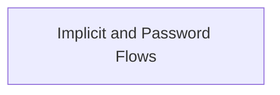

# Implicit and Password Flows

Details the specifications for OAuth 2.0 Implicit and Password grant types, enabling specific authentication mechanisms.

## Components

This module contains 2 component(s):

- `OAuthFlowImplicit`
- `OAuthFlowPassword`

## Structure

---
*This documentation was auto-generated to ensure completeness.*
