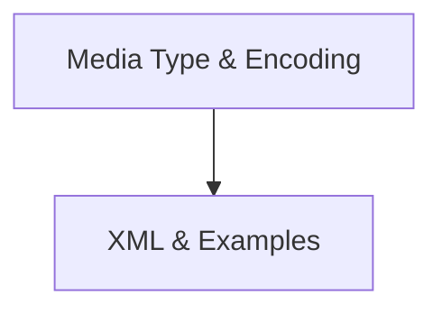

# Media And Examples Module Documentation

The `media_and_examples` module, nested within the `openapi_models_module`'s `schema_definitions`, is responsible for defining how media types, content encoding, XML serialization, and examples are handled within the OpenAPI specification. It plays a crucial role in enriching the API documentation by providing detailed information about request and response body structures.

## Architecture Overview

The `media_and_examples` module is composed of two primary sub-modules, each focusing on specific aspects of media handling and examples within the OpenAPI schema:

<!-- DIAGRAM_JSON
{
    "direction": "TD",
    "nodes": [
        {"id": "media_type_and_encoding", "label": "Media Type & Encoding", "type": "module", "link": "media_type_and_encoding.md"},
        {"id": "xml_and_examples", "label": "XML & Examples", "type": "module", "link": "xml_and_examples.md"}
    ],
    "edges": [
        {"source": "media_type_and_encoding", "target": "xml_and_examples"}
    ],
    "groups": []
}
-->

## Sub-modules

### [Media Type & Encoding](media_type_and_encoding.md)

This sub-module focuses on the `MediaType` and `Encoding` components. It handles the specification of various media types used for API requests and responses, allowing for detailed content negotiation and definition of how different parts of a request or response body are encoded.

### [XML & Examples](xml_and_examples.md)

This sub-module deals with the `XML` and `Example` components. It defines the structure for XML serialization within the OpenAPI schema and provides mechanisms to include illustrative examples for API requests and responses, making the documentation clearer and more usable for developers.