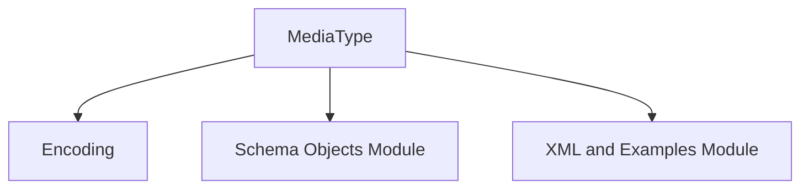

# `media_type_and_encoding` Module Documentation

## Introduction

The `media_type_and_encoding` module is a crucial part of the OpenAPI models, specifically focusing on the definition and serialization of media types and content encoding within an API's request bodies and responses. This module provides the core components `MediaType` and `Encoding`, which are fundamental for accurately describing how data is structured and transmitted over the wire.

## Core Functionality

This module encapsulates the definitions for:

*   **`MediaType`**: Represents a specific media type object as defined in the OpenAPI Specification. It allows for detailing the schema of the content, providing examples, and specifying how the content is encoded.
*   **`Encoding`**: Describes the encoding for a single property in a `MediaType` object. This includes details like the content type of the property, the headers it might include, and style/explode properties for serialization.

Together, these components ensure that API documentation accurately reflects the expected data formats and how they should be handled by clients and servers.

## Architecture and Component Relationships

The `media_type_and_encoding` module is a leaf module within the `openapi_models_module` hierarchy, nested under `schema_definitions` and `media_and_examples`. It directly defines the `MediaType` and `Encoding` components and depends on other schema-related modules for comprehensive type definitions and examples.

<!-- DIAGRAM_JSON
{
    "direction": "TD",
    "nodes": [
        {"id": "media_type", "label": "MediaType", "type": "component", "link": null},
        {"id": "encoding", "label": "Encoding", "type": "component", "link": null},
        {"id": "schema_objects_module", "label": "Schema Objects Module", "type": "external", "link": "schema_objects.md"},
        {"id": "xml_and_examples_module", "label": "XML and Examples Module", "type": "external", "link": "xml_and_examples.md"}
    ],
    "edges": [
        {"source": "media_type", "target": "encoding"},
        {"source": "media_type", "target": "schema_objects_module"},
        {"source": "media_type", "target": "xml_and_examples_module"}
    ],
    "groups": []
}
-->

*   **`MediaType`**: This component serves as the central point for defining the format of data. It can reference schemas defined in the [schema_objects_module](schema_objects.md) and examples/XML structures from the [xml_and_examples_module](xml_and_examples.md). It also incorporates `Encoding` for property-specific content handling.
*   **`Encoding`**: Provides detailed instructions on how individual properties within a `MediaType` are encoded, including their content type and header specifications.

## System Integration

As a foundational part of the `openapi_models_module`, `media_type_and_encoding` is integral to constructing complete and accurate OpenAPI specifications. It enables the precise description of request and response bodies, ensuring that API consumers have clear guidelines on how to send and receive data.

This module's definitions are utilized by higher-level components of the OpenAPI specification generation process to produce machine-readable and human-understandable API documentation. Its concepts are crucial for tools that parse and validate API interactions based on the OpenAPI standard.