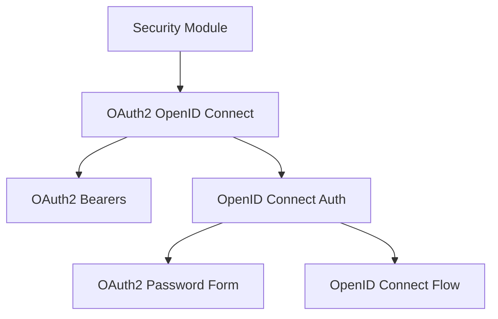

# OAuth2 Bearers Module

## Introduction and Purpose
The `oauth2_bearers` module is a crucial component within the larger `security_module`, specifically focusing on implementing standard OAuth2 bearer token authentication schemes. It provides classes for handling the retrieval of OAuth2 tokens using both the password flow and the authorization code flow, making it a foundational element for securing API endpoints.

This module encapsulates the logic necessary for applications to interact with OAuth2 providers, allowing clients to obtain and use bearer tokens for authentication against protected resources.

## Architecture and Component Relationships
The `oauth2_bearers` module is a direct child of the `oauth2_openid_connect` module, which itself is part of the `security_module`. It works in conjunction with other security-related modules to provide a comprehensive authentication and authorization framework. While this module focuses on the bearer token mechanisms, its functionality is often leveraged by other components in the `security_module` that define how these tokens are received, validated, and used to protect routes.

<!-- DIAGRAM_JSON
{
    "direction": "TD",
    "nodes": [
        {"id": "security_module", "label": "Security Module", "type": "module", "link": "security_module.md"},
        {"id": "oauth2_openid_connect", "label": "OAuth2 OpenID Connect", "type": "module", "link": "oauth2_openid_connect.md"},
        {"id": "oauth2_bearers", "label": "OAuth2 Bearers", "type": "module", "link": "oauth2_bearers.md"},
        {"id": "openid_connect_auth", "label": "OpenID Connect Auth", "type": "module", "link": "openid_connect_auth.md"},
        {"id": "oauth2_password_form", "label": "OAuth2 Password Form", "type": "module", "link": "oauth2_password_form.md"},
        {"id": "openid_connect_flow", "label": "OpenID Connect Flow", "type": "module", "link": "openid_connect_flow.md"}
    ],
    "edges": [
        {"source": "security_module", "target": "oauth2_openid_connect"},
        {"source": "oauth2_openid_connect", "target": "oauth2_bearers"},
        {"source": "oauth2_openid_connect", "target": "openid_connect_auth"},
        {"source": "openid_connect_auth", "target": "oauth2_password_form"},
        {"source": "openid_connect_auth", "target": "openid_connect_flow"}
    ],
    "groups": []
}
-->

## High-Level Functionality

This module provides the core components for handling OAuth2 bearer tokens:

*   **`OAuth2PasswordBearer`**: This component facilitates the retrieval of OAuth2 tokens using the **password grant type**. It's designed for scenarios where the client has a high level of trust with the user and can securely collect their credentials (username and password) to exchange them for an access token. It abstracts away the details of the token request, providing a straightforward interface for obtaining bearer tokens.

*   **`OAuth2AuthorizationCodeBearer`**: This component is used for the **authorization code grant type**, a more secure flow suitable for public and confidential clients. It involves redirecting the user to an authorization server to grant permission, receiving an authorization code, and then exchanging that code for an access token. This component simplifies the implementation of this multi-step flow.

These components are essential for building secure APIs that rely on OAuth2 for authentication, allowing developers to integrate with various identity providers and secure their applications.

For more information on related security concepts, refer to the [security_module.md](security_module.md) documentation. For details on how these bearers integrate with OpenID Connect, see [oauth2_openid_connect.md](oauth2_openid_connect.md) and [openid_connect_auth.md](openid_connect_auth.md).
