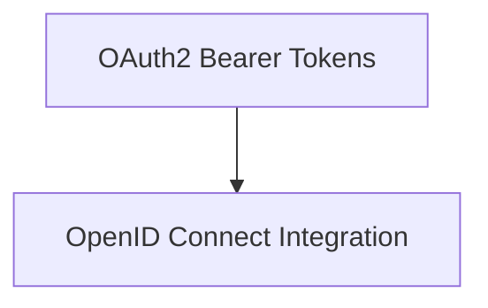

# OAuth2 and OpenID Connect Module

## Introduction

The `oauth2_openid_connect` module provides essential tools and utilities for implementing OAuth2 and OpenID Connect based authentication and authorization within FastAPI applications. It leverages various security schemes to handle bearer tokens, authorization codes, and OpenID Connect flows, ensuring robust and secure API access.

## Architecture Overview

This module is composed of two primary sub-modules, each focusing on specific aspects of OAuth2 and OpenID Connect security:

<!-- DIAGRAM_JSON
{
    "direction": "TD",
    "nodes": [
        {"id": "oauth2_bearers", "label": "OAuth2 Bearer Tokens", "type": "module", "link": "oauth2_bearers.md"},
        {"id": "openid_connect_auth", "label": "OpenID Connect Integration", "type": "module", "link": "openid_connect_auth.md"}
    ],
    "edges": [
        {"source": "oauth2_bearers", "target": "openid_connect_auth"}
    ],
    "groups": []
}
-->

## Sub-modules

### [OAuth2 Bearer Tokens](oauth2_bearers.md)
This sub-module focuses on the implementation of OAuth2 bearer token schemes. It includes components like `OAuth2PasswordBearer` and `OAuth2AuthorizationCodeBearer` which are crucial for handling token-based authentication flows, particularly for password and authorization code grants.

### [OpenID Connect Integration](openid_connect_auth.md)
This sub-module provides utilities for integrating OpenID Connect, an authentication layer on top of OAuth2. It also includes `OAuth2PasswordRequestFormStrict` which is used for handling the specific form data required for the OAuth2 password grant type, ensuring strict adherence to the specification. The `OpenIdConnect` component is central to enabling identity verification through OpenID providers.