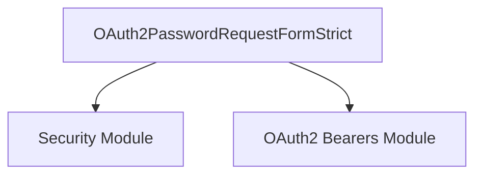

# oauth2_password_form Module Documentation

## Introduction

The `oauth2_password_form` module is a leaf module within the security component of the system, specifically designed to handle the OAuth2 Password Grant type. Its primary responsibility is to provide the `OAuth2PasswordRequestFormStrict` class, which is a dependency that FastAPI applications can use to parse form data containing a username and password for authentication. This module simplifies the process of securely receiving user credentials for token issuance.

## Architecture and Component Relationships

The `oauth2_password_form` module's core component, `OAuth2PasswordRequestFormStrict`, plays a crucial role in the authentication flow by providing a standardized way to extract user credentials from incoming requests. It primarily integrates with other security components, especially those related to OAuth2 token generation and validation.

<!-- DIAGRAM_JSON
{
    "direction": "TD",
    "nodes": [
        {"id": "oauth2_password_request_form_strict", "label": "OAuth2PasswordRequestFormStrict", "type": "component", "link": null},
        {"id": "security", "label": "Security Module", "type": "external", "link": "security.md"},
        {"id": "oauth2_bearers", "label": "OAuth2 Bearers Module", "type": "external", "link": "oauth2_bearers.md"}
    ],
    "edges": [
        {"source": "oauth2_password_request_form_strict", "target": "security"},
        {"source": "oauth2_password_request_form_strict", "target": "oauth2_bearers"}
    ],
    "groups": []
}
-->


## Core Functionality

The `oauth2_password_form` module exposes `OAuth2PasswordRequestFormStrict`, which acts as a FastAPI dependency. This dependency parses an incoming request's form data, expecting fields for `username` and `password`. It ensures that these fields are present and correctly formatted, making it suitable for use in authentication endpoints that implement the OAuth2 password grant flow.

### OAuth2PasswordRequestFormStrict

This class is a Pydantic model (or similar data structure) that is designed to be used with FastAPI's `Depends` system. When included as a dependency in a route handler, FastAPI will automatically attempt to read the `username` and `password` from the request's form data.

**Key features:**
*   **Form Data Parsing:** Automatically extracts `username` and `password` from the request body as form data.
*   **Validation:** Ensures the presence of required fields, simplifying credential handling.
*   **Integration with FastAPI:** Seamlessly integrates into FastAPI's dependency injection system, making it easy to use in path operations.

## How it Fits into the Overall System

The `oauth2_password_form` module is a critical piece in the overall security architecture, particularly for applications that need to support traditional username/password authentication using the OAuth2 Password Grant.

It is typically used in conjunction with a token endpoint, where a user provides their credentials. An endpoint might look like this:

```python
from fastapi import APIRouter, Depends, HTTPException, status
from fastapi.security import OAuth2PasswordRequestForm

router = APIRouter()

@router.post("/token")
async def login_for_access_token(form_data: OAuth2PasswordRequestFormStrict = Depends()):
    user = authenticate_user(form_data.username, form_data.password)
    if not user:
        raise HTTPException(
            status_code=status.HTTP_401_UNAUTHORIZED,
            detail="Incorrect username or password",
            headers={"WWW-Authenticate": "Bearer"},
        )
    access_token = create_access_token(data={"sub": user.username})
    return {"access_token": access_token, "token_type": "bearer"}
```

In this flow, `OAuth2PasswordRequestFormStrict` handles the initial parsing of credentials. The credentials are then validated against user storage (e.g., a database), and if valid, an access token is generated using mechanisms provided by other modules like those found in the [oauth2_bearers module](oauth2_bearers.md) or directly within the main [security module](security.md).

This module provides the necessary structure to process the client's request for an access token using their resource owner credentials (username and password) securely and efficiently within the FastAPI framework.
