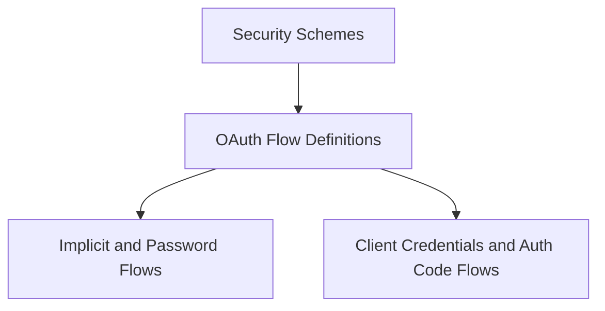

# oauth_flows Module Documentation

The `oauth_flows` module, a sub-component of `security_schemes` within `openapi_models_module`, is responsible for defining and managing the various OAuth 2.0 authorization flows. It provides the necessary structures to describe how a client application can obtain an access token. This module is crucial for accurately representing the security requirements and mechanisms in OpenAPI specifications.

## Architecture

The `oauth_flows` module is structured to delineate different OAuth 2.0 grant types and their overarching definitions. It interacts closely with its parent `security_schemes` module to provide comprehensive security definitions for an API.

<!-- DIAGRAM_JSON
{
    "direction": "TD",
    "nodes": [
        {"id": "security_schemes", "label": "Security Schemes", "type": "module", "link": "security_schemes.md"},
        {"id": "oauth_flow_definitions", "label": "OAuth Flow Definitions", "type": "module", "link": "oauth_flow_definitions.md"},
        {"id": "implicit_and_password_flows", "label": "Implicit and Password Flows", "type": "module", "link": "implicit_and_password_flows.md"},
        {"id": "client_credentials_and_auth_code_flows", "label": "Client Credentials and Auth Code Flows", "type": "module", "link": "client_credentials_and_auth_code_flows.md"}
    ],
    "edges": [
        {"source": "security_schemes", "target": "oauth_flow_definitions"},
        {"source": "oauth_flow_definitions", "target": "implicit_and_password_flows"},
        {"source": "oauth_flow_definitions", "target": "client_credentials_and_auth_code_flows"}
    ],
    "groups": []
}
-->

## Sub-modules

This module is composed of the following sub-modules:

*   **[OAuth Flow Definitions](oauth_flow_definitions.md)**: This sub-module defines the core structures for OAuth 2.0 flows, including the encompassing `OAuthFlows` and `OAuth2` specifications. It provides the foundational elements for describing different OAuth authorization mechanisms.

*   **[Implicit and Password Flows](implicit_and_password_flows.md)**: This sub-module details the specifications for OAuth 2.0 Implicit and Password grant types. It includes components like `OAuthFlowImplicit` and `OAuthFlowPassword` to enable specific authentication mechanisms within the OpenAPI documentation.

*   **[Client Credentials and Auth Code Flows](client_credentials_and_auth_code_flows.md)**: This sub-module covers the OAuth 2.0 Client Credentials and Authorization Code grant types. It outlines secure methods for application and user authorization using `OAuthFlowClientCredentials` and `OAuthFlowAuthorizationCode`.

## How it fits into the overall system

The `oauth_flows` module is an integral part of the `openapi_models_module`, specifically nested within `security_schemes`. It provides the detailed descriptions of various OAuth 2.0 grant types, which are then referenced by security schemes to specify how an API is secured. By standardizing these flow definitions, it ensures consistency and clarity in API security documentation, enabling proper client implementation for authentication and authorization.

For more information on the parent module, refer to the [security_schemes documentation](security_schemes.md).