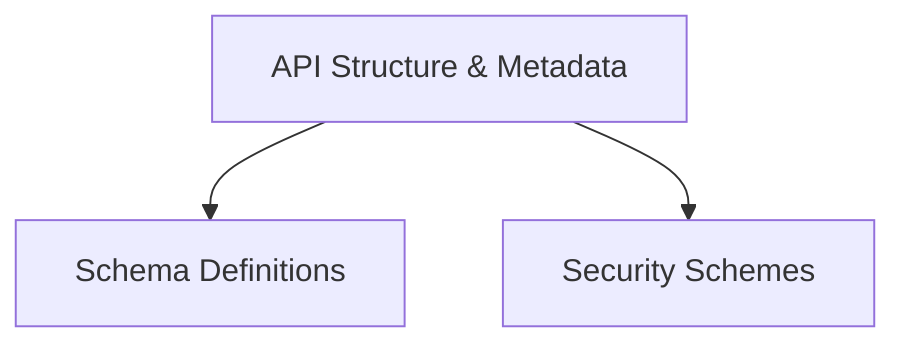

# OpenAPI Models Module

The `openapi_models_module` serves as a foundational component for defining and managing the data structures essential for generating OpenAPI 3.x specifications. It encapsulates a wide array of models, ranging from core schema definitions to security schemes and the overall API structure, enabling robust and standardized API documentation and interaction.

## Architecture Overview

The `openapi_models_module` is logically divided into three primary sub-modules, each responsible for a distinct aspect of the OpenAPI specification. This modular approach enhances maintainability, readability, and reusability of the OpenAPI component definitions.

<!-- DIAGRAM_JSON
{
    "direction": "TD",
    "nodes": [
        {"id": "api_structure", "label": "API Structure & Metadata", "type": "module", "link": "api_structure.md"},
        {"id": "schema_definitions", "label": "Schema Definitions", "type": "module", "link": "schema_definitions.md"},
        {"id": "security_schemes", "label": "Security Schemes", "type": "module", "link": "security_schemes.md"}
    ],
    "edges": [
        {"source": "api_structure", "target": "schema_definitions"},
        {"source": "api_structure", "target": "security_schemes"}
    ],
    "groups": []
}
-->

## Sub-modules

### API Structure & Metadata

This sub-module ([api_structure.md](api_structure.md)) focuses on the high-level organization of an OpenAPI document. It includes models for defining API information (`Info`, `Contact`, `License`), available paths and operations (`PathItem`, `Operation`, `RequestBody`), and external documentation references.

### Schema Definitions

The `schema_definitions` sub-module ([schema_definitions.md](schema_definitions.md)) is responsible for defining the data types and structures used throughout the API. It encompasses models like `Schema`, `Example`, `MediaType`, `Discriminator`, and `Reference`, which are crucial for describing the format of request and response bodies.

### Security Schemes

Dedicated to securing API endpoints, the `security_schemes` sub-module ([security_schemes.md](security_schemes.md)) provides models for various authentication and authorization mechanisms. This includes `HTTPBearer` tokens, different `OAuth2` flows (Implicit, Password, Client Credentials, Authorization Code), `APIKey` definitions, and `OpenIdConnect` configurations.
