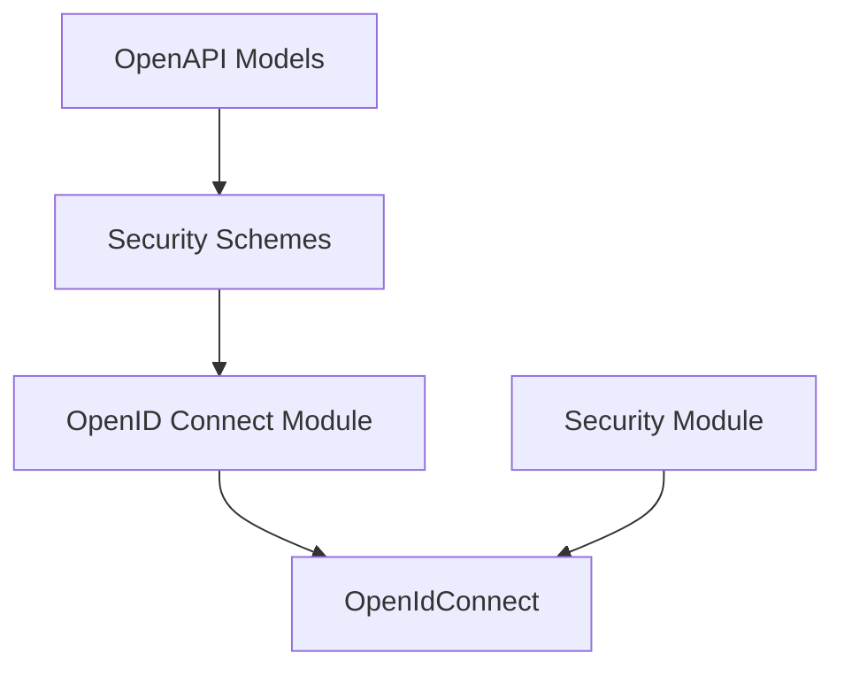

# openid_connect Module Documentation

## Introduction

The `openid_connect` module is a focused component within the larger `openapi_models` and `security_schemes` structure. Its primary responsibility is to define the `OpenIdConnect` security scheme, which is used to specify OpenID Connect Discovery-based security for OpenAPI documents.

This module plays a crucial role in enabling applications to declare their OpenID Connect security requirements, allowing for standardized authentication and authorization configurations within the OpenAPI specification.

## Architecture and Component Relationships

The `openid_connect` module is a leaf module, meaning it does not contain sub-modules. Its core functionality is encapsulated within the `OpenIdConnect` component, which represents the OpenID Connect security scheme as defined in the OpenAPI Specification.

It is situated under the `security_schemes` module, which aggregates various security scheme definitions. The `security_schemes` module, in turn, is part of the `openapi_models` module, which provides a comprehensive set of data structures for representing OpenAPI documents.

Furthermore, the `OpenIdConnect` component defined here can be utilized by the `security_module` to implement and integrate OpenID Connect-based security features within the application.

<!-- DIAGRAM_JSON
{
    "direction": "TD",
    "nodes": [
        {"id": "openid_connect_module", "label": "OpenID Connect Module", "type": "component", "link": null},
        {"id": "openid_connect_component", "label": "OpenIdConnect", "type": "component", "link": null},
        {"id": "security_schemes", "label": "Security Schemes", "type": "external", "link": "security_schemes.md"},
        {"id": "openapi_models", "label": "OpenAPI Models", "type": "external", "link": "openapi_models.md"},
        {"id": "security_module", "label": "Security Module", "type": "external", "link": "security_module.md"}
    ],
    "edges": [
        {"source": "openid_connect_module", "target": "openid_connect_component"},
        {"source": "security_schemes", "target": "openid_connect_module"},
        {"source": "openapi_models", "target": "security_schemes"},
        {"source": "security_module", "target": "openid_connect_component"}
    ],
    "groups": []
}
-->

## Core Functionality

The `openid_connect` module provides the `OpenIdConnect` class, which is a data model for representing the OpenID Connect security scheme. This class typically includes attributes such as `openIdConnectUrl`, which points to the OpenID Connect Discovery Document.

This component is essential for:
*   **OpenAPI Specification Generation**: Accurately describing the OpenID Connect security requirements in generated OpenAPI documentation.
*   **Client Generation**: Enabling client-side tools to understand and correctly implement authentication flows based on OpenID Connect.

## Integration with Overall System

The `openid_connect` module integrates into the broader system as follows:

*   **Part of `openapi_models`**: It contributes to the comprehensive set of OpenAPI data models, ensuring that all aspects of an OpenAPI document, including security, can be fully represented.
*   **Security Schemes Definition**: As part of the `security_schemes` module, it stands alongside other security definitions like HTTP Bearer, OAuth2, and API Key schemes. This allows for a unified approach to defining various security mechanisms.
*   **Used by `security_module`**: The `security_module` can leverage the `OpenIdConnect` model to configure and enforce OpenID Connect-based authentication and authorization policies for API endpoints. This provides a direct link between the OpenAPI specification and the application's runtime security enforcement.

By centralizing the definition of the OpenID Connect scheme, this module ensures consistency and reusability across the system, making it easier to manage and maintain security configurations.