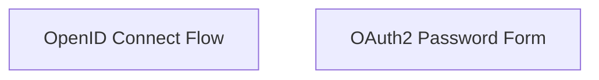

# OpenID Connect Authentication Module

## Introduction
The `openid_connect_auth` module provides core components for implementing OpenID Connect and OAuth2 password grant type authentication within the system. It builds upon the broader [security module](security.md) and its child module [oauth2_openid_connect](oauth2_openid_connect.md), offering specific tools for handling identity verification and user credential submission.

## Architecture Overview
This module is structured into two main sub-modules, each addressing a specific aspect of authentication:
- **OpenID Connect Flow**: Manages the interactions and processes related to the OpenID Connect protocol.
- **OAuth2 Password Form**: Handles the secure submission and processing of user credentials for OAuth2 password grant type.

<!-- DIAGRAM_JSON
{
    "direction": "TD",
    "nodes": [
        {"id": "openid_connect_flow", "label": "OpenID Connect Flow", "type": "module", "link": "openid_connect_flow.md"},
        {"id": "oauth2_password_form", "label": "OAuth2 Password Form", "type": "module", "link": "oauth2_password_form.md"}
    ],
    "edges": [],
    "groups": []
}
-->

## Sub-modules

### OpenID Connect Flow
This sub-module, documented in [openid_connect_flow.md](openid_connect_flow.md), encapsulates the logic for integrating OpenID Connect, a simple identity layer on top of the OAuth 2.0 protocol. It facilitates secure user authentication and obtaining basic profile information from an Authorization Server.

### OAuth2 Password Form
Detailed in [oauth2_password_form.md](oauth2_password_form.md), this sub-module provides the necessary components for handling `OAuth2PasswordRequestFormStrict`. It is designed to securely accept and process user credentials (username and password) directly from a client, typically used in trusted first-party applications. This component ensures adherence to strict form validation and security practices for the OAuth2 password grant type.
