FastAPI is a modern, fast (high-performance) web framework for building APIs with Python 3.7+ based on standard Python type hints. It is designed to be easy to use, highly performant, and provides automatic interactive API documentation (OpenAPI/Swagger UI). The repository contains the core components that enable robust request handling, routing, data validation, security, and OpenAPI specification generation.

### Architecture Overview

The `fastapi` repository is structured around several core modules that work together to provide a comprehensive API development experience. The central `applications_module` orchestrates the entire application, leveraging functionalities from other modules for data handling, middleware, routing, security, and OpenAPI documentation.

```mermaid
graph TD
    A[Applications Module]
    D[Datastructures Module]
    M[Middleware Module]
    O[OpenAPI Models Module]
    P[Parameters Module]
    R[Responses Module]
    RT[Routing Module]
    S[Security Module]
    C[Compatibility Module]

    A --> D
    A --> M
    A --> O
    A --> P
    A --> R
    A --> RT
    A --> S
    A --> C

    click A "applications_module.md" "View Applications Module"
    click D "datastructures_module.md" "View Datastructures Module"
    click M "middleware_module.md" "View Middleware Module"
    click O "openapi_models_module.md" "View OpenAPI Models Module"
    click P "params_module.md" "View Parameters Module"
    click R "responses_module.md" "View Responses Module"
    click RT "routing_module.md" "View Routing Module"
    click S "security_module.md" "View Security Module"
    click C "compat_module.md" "View Compatibility Module"
```

### Core Modules

*   **[Applications Module](applications_module.md)**: The core of the FastAPI application, responsible for orchestrating request handling, routing, and integrating various functionalities.
*   **[Datastructures Module](datastructures_module.md)**: Defines fundamental data structures, such as `UploadFile`, used for handling complex data types within requests.
*   **[Middleware Module](middleware_module.md)**: Provides middleware components like `AsyncExitStackMiddleware` for managing asynchronous context and resource cleanup across requests.
*   **[OpenAPI Models Module](openapi_models_module.md)**: Contains models for generating OpenAPI 3.x specifications, including schemas, security schemes, and API structure definitions.
*   **[Parameters Module](params_module.md)**: Defines and enumerates various parameter types (`ParamTypes`) used for request input validation and processing.
*   **[Responses Module](responses_module.md)**: Manages HTTP response types, such as `UJSONResponse`, for efficient data serialization and transmission.
*   **[Routing Module](routing_module.md)**: Responsible for defining and managing API routes using the `APIRoute` class, mapping incoming requests to handler functions.
*   **[Security Module](security_module.md)**: Implements various authentication and authorization mechanisms, including API keys, HTTP authentication, and OAuth2/OpenID Connect.
*   **[Compatibility Module](compat_module.md)**: Provides essential compatibility utilities, such as `BaseConfig`, for managing configuration settings and ensuring system-wide adaptability.