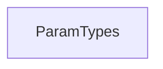

# params_module Documentation

## Introduction

The `params_module` is a foundational component of the system, primarily responsible for defining and enumerating various parameter types used throughout the API framework. It provides a standardized way to categorize and handle different kinds of input parameters, ensuring consistency and clarity in API definitions and request processing.

## Core Functionality

The central element of this module is `ParamTypes`, which likely serves as an enumeration or a collection of distinct parameter classifications. These classifications are crucial for:

*   **API Routing and Request Handling**: Guiding how incoming request data (e.g., path, query, header, cookie, body) is parsed and validated.
*   **OpenAPI Specification Generation**: Providing the necessary metadata to accurately describe parameters in the generated OpenAPI documentation, ensuring external consumers understand how to interact with the API.
*   **Type Hinting and Validation**: Enabling robust type checking and data validation mechanisms within the application.

By centralizing parameter type definitions, `params_module` simplifies the development of API endpoints and enhances the maintainability of the codebase.

## Architecture and Component Relationships

The `params_module` is a relatively self-contained module, primarily defining data structures rather than complex logic. Its core component, `ParamTypes`, serves as a fundamental building block that other modules consume to interpret and process API parameters.

It is consumed by modules responsible for:
*   **Request parsing**: Modules like `routing_module` would use `ParamTypes` to identify where to extract parameter values from an incoming HTTP request.
*   **Schema generation**: Modules within `openapi_models_module` would leverage `ParamTypes` to build accurate OpenAPI (Swagger) documentation.

<!-- DIAGRAM_JSON
{
    "direction": "TD",
    "nodes": [
        {"id": "param_types", "label": "ParamTypes", "type": "component", "link": null}
    ],
    "edges": [],
    "groups": []
}
-->

## Integration with the Overall System

`params_module` plays a crucial role in defining the contract between API clients and the server. It sits at a lower level of abstraction, providing fundamental type definitions that higher-level modules utilize.

It directly informs how request parameters are interpreted by the [routing_module](routing_module.md) and how they are represented in the API's documentation generated by components related to the [openapi_models_module](openapi_models_module.md). This central definition ensures that all parts of the system consistently understand and handle different types of parameters, from query strings to request bodies. The definitions provided here are crucial for the proper functioning of the [applications_module](applications_module.md) as it processes incoming requests.
