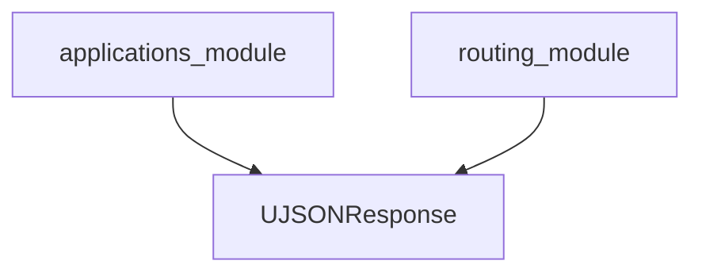

# responses_module Documentation

## Introduction

The `responses_module` is a critical component responsible for defining and managing various HTTP response types within the system. Its primary role is to provide specialized response classes that ensure consistent and efficient data serialization and transmission for API endpoints.

## Core Functionality

This module centralizes the implementation of custom response classes, allowing developers to easily return structured data, such as JSON, with appropriate HTTP headers and status codes. By providing ready-to-use response types, it streamlines API development and maintains a uniform approach to handling HTTP responses across the application.

## Architecture and Component Relationships

The `responses_module` primarily focuses on the `UJSONResponse` component, which is a specialized JSON response class. This class is designed to handle JSON serialization efficiently, often leveraging optimized JSON libraries for performance.

It serves as a fundamental building block for the `applications_module` (which utilizes FastAPI) and the `routing_module`, as these modules will instantiate and return `UJSONResponse` objects from their API endpoints to deliver data to clients. While `responses_module` doesn't directly depend on these modules for its implementation, it is a crucial dependency *for* them to function correctly.

<!-- DIAGRAM_JSON
{
    "direction": "TD",
    "nodes": [
        {"id": "ujson_response", "label": "UJSONResponse", "type": "component", "link": null},
        {"id": "applications_module", "label": "applications_module", "type": "external", "link": "applications_module.md"},
        {"id": "routing_module", "label": "routing_module", "type": "external", "link": "routing_module.md"}
    ],
    "edges": [
        {"source": "applications_module", "target": "ujson_response"},
        {"source": "routing_module", "target": "ujson_response"}
    ],
    "groups": []
}
-->
