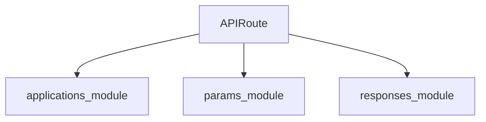

# routing_module Documentation

## Introduction

The `routing_module` is a foundational component responsible for defining and managing API routes within the system. Its core functionality revolves around the `APIRoute` class, which encapsulates the necessary information to map incoming requests to their respective handler functions.

## Core Functionality and Purpose

The primary purpose of the `routing_module` is to provide a standardized way to declare API endpoints. It integrates with the overall application framework (e.g., FastAPI in `applications_module`) to enable declarative route definitions, allowing developers to specify URL paths, HTTP methods, request and response models, dependencies, and other routing-related metadata.

Key functionalities include:
- **Route Definition**: Defining individual API routes using the `APIRoute` class.
- **Metadata Management**: Storing and associating metadata like tags, summary, description, and response types with each route.
- **Dependency Integration**: Facilitating the integration of dependency injection for route handlers.
- **Path Matching**: Providing the necessary constructs for the application framework to match incoming requests to the correct route.

## Architecture and Component Relationships

The `routing_module` centers around the `APIRoute` component, which serves as the blueprint for an API endpoint. It interacts closely with the `applications_module`, specifically the FastAPI framework, which uses `APIRoute` instances to build its routing table and dispatch requests.

<!-- DIAGRAM_JSON
{
    "direction": "TD",
    "nodes": [
        {"id": "api_route", "label": "APIRoute", "type": "component", "link": null},
        {"id": "applications_module", "label": "applications_module", "type": "external", "link": "applications_module.md"},
        {"id": "params_module", "label": "params_module", "type": "external", "link": "params_module.md"},
        {"id": "responses_module", "label": "responses_module", "type": "external", "link": "responses_module.md"}
    ],
    "edges": [
        {"source": "api_route", "target": "applications_module"},
        {"source": "api_route", "target": "params_module"},
        {"source": "api_route", "target": "responses_module"}
    ],
    "groups": []
}
-->

### Component Details

#### `APIRoute`

The `APIRoute` class is the core component of this module. It typically encapsulates:
- **Path**: The URL path string (e.g., `/items/{item_id}`).
- **Endpoint**: The callable function or method that handles the request.
- **Methods**: A set of HTTP methods supported by the route (e.g., `["GET", "POST"]`).
- **Dependencies**: A list of dependencies to be injected into the endpoint function.
- **Response Model**: The Pydantic model used for validating and serializing the response.
- **Tags, Summary, Description**: Metadata for OpenAPI documentation generation.

`APIRoute` objects are instantiated by the application framework (e.g., FastAPI) when `@app.get()`, `@app.post()`, etc., decorators are used, effectively registering the route with the application's router.

## Integration with the Overall System

The `routing_module` is a critical piece of the web service layer. It provides the mechanism for exposing application logic via HTTP endpoints. The `APIRoute` objects defined here are consumed by the `applications_module` (specifically FastAPI) to construct the API gateway. When a request comes in, the application uses these route definitions to determine which handler function to invoke, apply middleware from `middleware_module`, process parameters from `params_module`, and generate responses using components from `responses_module`.

It plays a central role in how external clients interact with the system, acting as the bridge between incoming HTTP requests and the internal business logic implemented in various parts of the application.