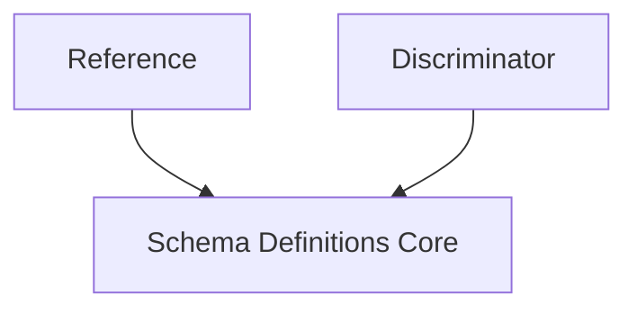

# schema_composition Module Documentation

## Introduction
The `schema_composition` module is a vital part of the `openapi_models_module` responsible for defining complex schema relationships and enabling polymorphism within OpenAPI specifications. It specifically handles the `Reference` and `Discriminator` components, which are crucial for reusing schema definitions and defining inheritance-like structures.

## Architecture and Component Relationships

The `schema_composition` module focuses on two key OpenAPI components:

*   **`Reference`**: Allows referencing other schema objects defined elsewhere in the OpenAPI specification or in external documents. This promotes reusability and reduces redundancy in schema definitions.
*   **`Discriminator`**: Used in conjunction with `oneOf` or `anyOf` keywords to enable polymorphism. It specifies a field in the payload that determines which specific schema applies for a given object, allowing clients to correctly interpret varying data structures based on a common base.

These components are intrinsically linked to the `Schema` object, which is the fundamental building block for defining data structures in OpenAPI. `Reference` enables schemas to point to other schemas, and `Discriminator` provides the mechanism for a `Schema` to act as a polymorphic base. Therefore, this module directly supports and enhances the functionality provided by the [schema_definitions_core](schema_definitions_core.md) module.

## How the module fits into the overall system

The `schema_composition` module is a sub-module of `schema_objects`, which in turn is part of `schema_definitions` within the larger `openapi_models_module`. Its primary role is to provide the mechanisms for creating sophisticated and DRY (Don't Repeat Yourself) OpenAPI schemas. By offering `Reference` for reuse and `Discriminator` for polymorphism, it allows developers to define complex data models that accurately reflect modern API design patterns. This module ensures that the generated OpenAPI documentation can precisely describe APIs that utilize inheritance or shared data structures, making the API easier to consume and understand for clients.

<!-- DIAGRAM_JSON
{
    "direction": "TD",
    "nodes": [
        {"id": "reference", "label": "Reference", "type": "component", "link": null},
        {"id": "discriminator", "label": "Discriminator", "type": "component", "link": null},
        {"id": "schema_definitions_core", "label": "Schema Definitions Core", "type": "external", "link": "schema_definitions_core.md"}
    ],
    "edges": [
        {"source": "reference", "target": "schema_definitions_core"},
        {"source": "discriminator", "target": "schema_definitions_core"}
    ],
    "groups": []
}
-->
