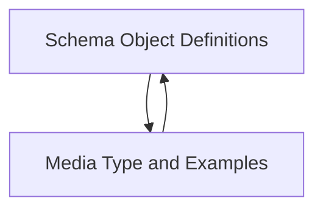

# `schema_definitions` Module Documentation

## Introduction
The `schema_definitions` module is a crucial part of the OpenAPI models, responsible for defining the structure and representation of data schemas used throughout the API. It provides core components for specifying data types, formats, examples, and relationships between different schemas.

## Architecture Overview
The `schema_definitions` module is composed of two primary sub-modules: `schema_objects` and `media_and_examples`. These sub-modules work together to ensure comprehensive and flexible data definition within the OpenAPI specification.

## Sub-modules:

*   **`schema_objects`**: This sub-module focuses on the fundamental building blocks for defining data structures, including the core `Schema` object, `Reference` for reusability, `Discriminator` for polymorphic schemas, and `EmailStr` for specific string formats. [Learn more about Schema Object Definitions](schema_objects.md)
*   **`media_and_examples`**: This sub-module handles the representation aspects of data, such as `MediaType` for content types, `XML` for XML serialization details, `Example` for providing sample data, and `Encoding` for specifying how message parts are serialized. [Learn more about Media Type and Examples](media_and_examples.md)

## Architecture Diagram

<!-- DIAGRAM_JSON
{
    "direction": "TD",
    "nodes": [
        {"id": "schema_objects", "label": "Schema Object Definitions", "type": "module", "link": "schema_objects.md"},
        {"id": "media_and_examples", "label": "Media Type and Examples", "type": "module", "link": "media_and_examples.md"}
    ],
    "edges": [
        {"source": "schema_objects", "target": "media_and_examples"},
        {"source": "media_and_examples", "target": "schema_objects"}
    ],
    "groups": []
}
-->

