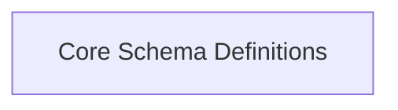

# Core Schema Definitions

Defines the fundamental Schema object and specialized data types like EmailStr for OpenAPI specifications.

## Components

This module contains 2 component(s):

- `Schema`
- `EmailStr`

## Structure

---
*This documentation was auto-generated to ensure completeness.*
