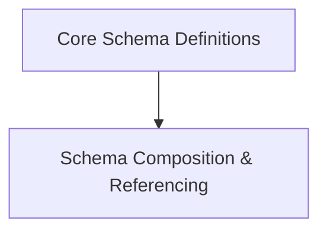

# `schema_objects` Module Documentation

## Introduction
The `schema_objects` module is a crucial component within the `openapi_models_module` that defines core elements for OpenAPI schema definitions. It provides the building blocks for describing data structures, including fundamental schema types, references to other schemas, and mechanisms for handling polymorphic models.

## Architecture Overview
The `schema_objects` module is logically divided into two sub-modules to manage its functionalities effectively:

*   **Core Schema Definitions (`schema_definitions_core`)**: Focuses on the primary `Schema` object and specific data types.
*   **Schema Composition & Referencing (`schema_composition`)**: Handles the advanced features for linking and defining complex schema relationships.

This structure ensures a clear separation of concerns and enhances maintainability.

<!-- DIAGRAM_JSON
{
    "direction": "TD",
    "nodes": [
        {"id": "schema_definitions_core", "label": "Core Schema Definitions", "type": "module", "link": "schema_definitions_core.md"},
        {"id": "schema_composition", "label": "Schema Composition & Referencing", "type": "module", "link": "schema_composition.md"}
    ],
    "edges": [
        {"source": "schema_definitions_core", "target": "schema_composition"}
    ],
    "groups": []
}
-->

## Sub-module Functionality

### Core Schema Definitions
This sub-module provides the foundational `Schema` component for defining data structures within OpenAPI specifications, along with specialized data types such as `EmailStr`. It encapsulates the core logic for representing diverse data types and their constraints. [Learn more](schema_definitions_core.md)

### Schema Composition & Referencing
This sub-module manages the `Reference` object, enabling the reuse of schema definitions across different parts of the API. It also includes the `Discriminator` component, which is essential for implementing polymorphic schemas, allowing a single schema definition to represent multiple related object types. [Learn more](schema_composition.md)
