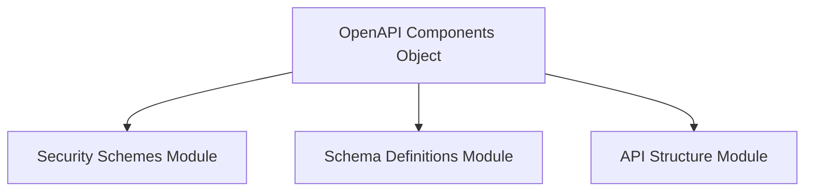

# Module: scheme_components

## Introduction
The `scheme_components` module is a vital part of the `openapi_models_module` within the system, specifically focusing on the definition and management of reusable OpenAPI components. It primarily encapsulates the `Components` object, which serves as a central registry for various sharable OpenAPI entities across the API.

## Purpose and Core Functionality
-   **Purpose**: To provide a standardized structure for defining and referencing reusable OpenAPI objects, promoting consistency and reducing redundancy in API definitions.
-   **Core Functionality**: This module defines the `Components` object as specified by the OpenAPI Specification. This object acts as a container for:
    -   Schemas (defined in [schema_definitions.md](schema_definitions.md))
    -   Security Schemes (defined in [security_schemes.md](security_schemes.md))
    -   Parameters, Headers, Links, and other API structure elements (defined in [api_structure.md](api_structure.md))

## Architecture and Component Relationships
The `scheme_components` module, through its `Components` object, serves as a central hub within the OpenAPI model, integrating definitions from various related modules. It does not contain complex internal logic but rather provides the structure for an aggregated view of reusable API elements.

## How the module fits into the overall system
This module is fundamental for building a well-structured and maintainable OpenAPI document. By centralizing the definitions of reusable components, it allows other parts of the OpenAPI specification (e.g., operations, paths) to reference these components by name, ensuring consistency and simplifying updates. It is an integral part of the `openapi_models_module`, providing the foundational structure for defining the reusable building blocks of the API.

<!-- DIAGRAM_JSON
{
    "direction": "TD",
    "nodes": [
        {"id": "components_object", "label": "OpenAPI Components Object", "type": "component", "link": null},
        {"id": "security_schemes_module", "label": "Security Schemes Module", "type": "external", "link": "security_schemes.md"},
        {"id": "schema_definitions_module", "label": "Schema Definitions Module", "type": "external", "link": "schema_definitions.md"},
        {"id": "api_structure_module", "label": "API Structure Module", "type": "external", "link": "api_structure.md"}
    ],
    "edges": [
        {"source": "components_object", "target": "security_schemes_module"},
        {"source": "components_object", "target": "schema_definitions_module"},
        {"source": "components_object", "target": "api_structure_module"}
    ],
    "groups": []
}
-->
